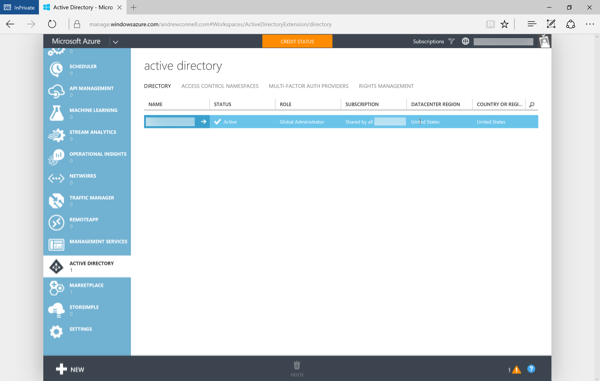
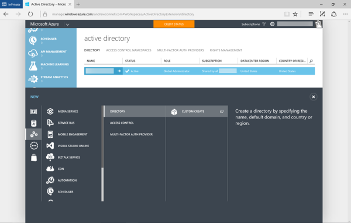
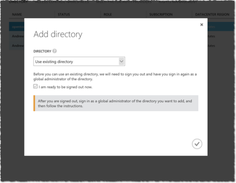
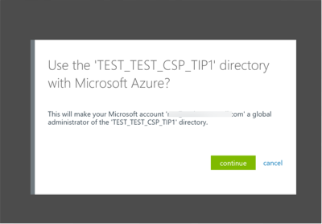

# Associating Azure AD Tenants with Azure Subscriptions

Partner / reseller accounts as part of the CSP program have an Azure AD tenant. This tenant contains the following things:

- users that belong (employed) to the partner / reseller
- customers of the partner / reseller
- applications created by the partner granted permission to the Partner Center API

Many application management scenarios for Azure AD (AAD) applications used in Partner Center solutions can be handled by the Partner Center dashboard. However some user and AAD application management scenarios require the use of the Azure Management Portal (https://manage.windowsazure.com). In order to manage an AAD tenant it must be associated with a valid Azure subscription. This means you must have an Azure subscription in order to view and administer the contents of an Azure AD tenant.

In addition, you must add the Azure AD tenant to an existing Azure subscription.

This page will explain how to associate an Azure AD tenant with an existing Azure subscription.

> NOTE: This topic is also covered by the MVA video [Onboarding with the CSP Partner Center SDK](https://mva.microsoft.com/en-US/training-courses/onboarding-with-the-csp-partner-center-sdk-15789?l=Y03umf64B_300115881). In addition it is also covered in the Azure documentation [Manage the directory for your Office 365 subscription in Azure](https://azure.microsoft.com/en-us/documentation/articles/active-directory-manage-o365-subscription/). While it addresses Office 365, the scenario is identical with Partner Center AAD tenants.

1. Login into the Azure Management Portal (https://manage.windowsazure.com) using an account that has administrative rights an existing Azure subscription.

  > Note: You can use any Azure subscription, including trial subscriptions that do not cost anything, those you receive with an MSDN subscription or commercial subscriptions.

1. Once you have logged in, locate & select the **Active Directory** item in the left-hand menu.

1. On the **Active Directory** page, click the :heavy_plus_sign: **NEW** button in the bottom gutter menu:

  

  1. Select **Directory** :arrow_right: **Custom Create** in the menu that appears from the bottom gutter control.

    

  1. In the **Add Directory** dialog that appears, select the **Use existing directory** option & check the **I am ready to be signed out now** check box.

    > Note: If you do not see the option **Use existing directory**, then you are not signed into Azure using an administrative account on your Azure subscription. Logout and try again.

    

    Click the check icon in the lower right to sign out. You will then be signed out and taken to the Azure login page again. 

  1. This time, sign in using the admin account on the Azure AD tenant you want to add to your Azure subscription. For CSP partners, this is the account you use to access the Partner Center website.

  1. After logging in, Azure will ask if you want to add the account you were originally signed in with a global administrator for your CSP Azure AD tenant:

    

  1. Click **Continue** in the dialog above to add the user as a global administrator to your CSP Azure AD tenant.

1. Verify you can access the tenant by logging out of Azure AD and then logging back into the Azure Management Portal using the administrative account of your original Azure subscription. 

  When you navigate to the **Active Directory** menu item, you should see your CSP partner's Azure AD tenant.