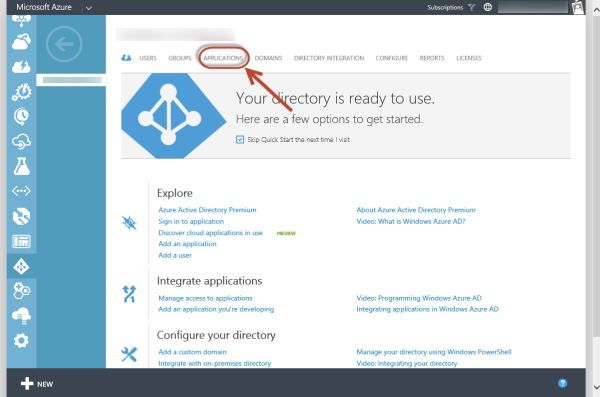
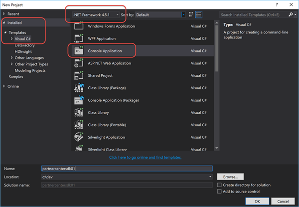
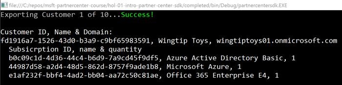
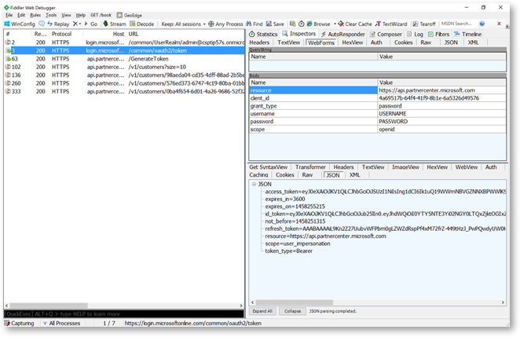
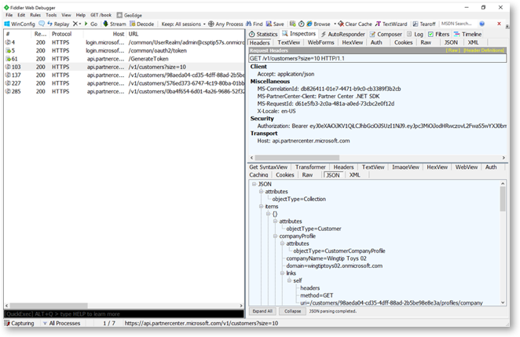
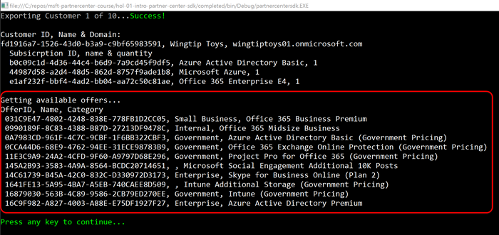
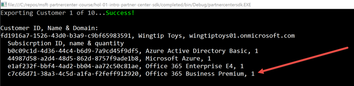

# Introduction to the Partner Center SDK

The Partner Center SDK provides a superset of the earlier CREST API functionality and enables partners to connect their sales and billing systems to Microsoft for the purposes of selling Microsoft Commercial Cloud software. This Visual Studio based lab takes you through a simple application that the partner would write which creates a customer and sells that customer a new subscription using the Partner Center SDK. Some experience with Visual Studio and C# is required.


## Prerequisites

*Refer to the [Hands-On Lab Prerequisites](../hol-prereqs.md) for a full list of all prerequisites, additional details and additional resources.*

- Have access to the [Partner Center](https://partnercenter.microsoft.com) website & your partner ID.
- Have the login information for your CSP Integration Sandbox account.
- Developer environment with Visual Studio 2015 installed & configured.


## Exercise 1: Create an Azure AD Application

In this exercise you will register an Azure AD application with your Partner Center account for use in future exercises.

The Partner Center dashboard can onboard new Azure AD web applications for use with the Partner Center SDK as well as onboard existing applications. In this lab you will build a console application which requires the onboarding of an Azure AD native application. 

Therefore, you must first create the application in Azure AD before onboarding it with Partner Center.

1. Navigate to the **Azure Management Portal**: https://manage.windowsazure.com.
1. Enter the credentials for your Azure Subscription that has access to manage your Integration Sandbox's AAD directory.

  > If you have not associated your Integration Sandbox AAD directory with an Azure subscription or this is not familiar, refer to this document: [Associating CSP Integration Sandbox Azure AD directory with Azure Subscription](../asscociate-aad-dir-azure-sub.md).

1. In the left-hand navigation, scroll down and select the **Active Directory** menu item.
1. Click on the name of the directory for your CSP Integration Sandbox.
1. Click on the **Applications** menu item at the top of the page:

  

1. Click the **Add** button in the bottom of the page.
  1. On the **What do you want to do?** page, select **Add an application my organization is developing**
  1. On the **Tell us about your application** page, set the following values:
    - **Name:** My Partner Center App 01
    - **Native client application:** checked
  1. On the **Application Information** page, set the **Redirect URI** to **http://localhost:3421**. *The address you enter does not matter as you will create a console app that logs the user in without redirecting anywhere.*

1. Once the app has been created, click the **Configure** menu item at the top of the page.
1. Copy the **Client ID** as you will need it later when you create the client application. This will be referred to as the *AAD application's client ID* later in the lab.

At this point you have a native Azure AD application registered.
With an Azure AD application registered, you now need to onboard the application in Partner Center.

1. Within a browser, navigate to the Partner Center dashboard, **https://partnercenter.microsoft.com**, and login using your Partner account’s credentials.
1. In the left-hand navigation, select **Account Settings**.
1. In the left-hand navigation, select **API**.
1. On the API page, select the application **My Partner App 01** from the list of available options in the selector and click the **Register App** button.

At this point you have on-boarded the native Azure AD application with the Partner Center SDK. It now has the necessary permissions within your partner account & AAD tenant to use the SDK.

## Exercise 2: Create Customers with a C# Console App

In this exercise you will create a C# console application that will use the Partner Center SDK to create a customer. Then you will inspect the raw HTTP requests made by the SDK using Fiddler.

### Collect Necessary Details from the Integration Sandbox in the Partner Center
Before creating the console application, you need to collect a few more details from your Integration Sandbox in the Partner Center.

1. Within a browser, navigate to the Partner Center: https://partnercenter.microsoft.com.
1. Click the **Sign in** link in the upper right corner & login using your Integration Sandbox account credentials.
1. In the left-hand navigation, select **Account Settings**.
1. In the left-hand navigation, select **Organization Profile**.
1. On the **Organization Profile** page, locate the value of the **Microsoft ID** and copy it for future use. This will be referred to as the *Account ID* later in the lab.

### Create Console Application
Create a C# console application that queries and creates customers using the Partner Center SDK.

1. Launch **Visual Studio 2015**.
1. Create a new console application project:
  1. Select **File** :arrow_right: **New** :arrow_right: **Project**
  1. In the **New Project** dialog, from the **Visual C#** templates, select **Console Application**.
  1. Ensure the **.NET Framework 4.5.1** is selected at the top for the target platform.
  1. Set a name & location for the project and click **OK**.

    

Before you start coding, add some NuGet package dependencies that you will need in the project.

1. Within the **Solution Explorer** tool pane, right-click the project and select **Manage NuGet Packages...**.
1. Find and install the following two packages:
  - Newtonsoft.Json *v8.0.**
  - Microsoft.IdentityModel.Clients.ActiveDirectory *v2.19.**
  - Microsoft.Store.PartnerCenter *v1.**
1. You must add a reference to `ConfigurationManager`:
  1. Within the **Solution Explorer** tool pane in Visual Studio, right-click the **References** tab and select **Add Reference...**.
  ii.	In the **Reference Manager** dialog, click the **Browse** button.
  1. Click **Assemblies** in the tree view on the left to open it and select **Framework**.
  1. Locate and add a check mark next to `System.Configuration` and click **OK**.

Now that the project is setup, you can code the console application to communicate with the Partner Center SDK.

1. Setup application configuration settings:
  1. Open the `App.config` file within the project.
  1. Add the following section to the `App.config` file between the `<startup />` & `<runtime />` sections as follows:

    ```xml
    <appSettings>
      <!-- azure ad directory details -->
      <add key="aad:tenant-id" value=""/>
      
      <!-- azure ad application details -->
      <add key="aad:client-id" value=""/>
      <add key="aad:client-secret" value=""/>
      
      <!-- partner center api -->
      <add key="partnercenter-endpoint" value=""/>
      <add key="partnercenter-resource" value=""/>
      
      <!-- user details -->
      <add key="partner-user" value=""/>
      <add key="partner-password" value=""/>
    </appSettings>
    ```

  1. Use the following keys to set the values of the app settings you added above:
    - **aad:tenant-id:** the **account id** you copied from the Partner Center website
    - **aad:client-id:** the **AAD application's client ID** you created previously
    - **aad:client-secret:** leave this blank
    - **partnercenter-endpoint:** `https://api.partnercenter.microsoft.com`
    - **partnercenter-resource:** `https://api.partnercenter.microsoft.com`
    - **partner-user:** the username (email) for the account you use to login to your Integration Sandbox in Partner Center
    - **partner-password:** the password for the account you use to login to your Integration Sandbox in Partner Center
  1. Add a new class to the project to access settings:
    1. Right-click the project within the **Solution Explorer** tool window and select **Add** :arrow_right: **Class**.
    1. Set the name of the class to **SettingsHelper.cs** and click **OK**.
  1. Add the following `using` statement to the top of the `SettingsHelper.cs` code file, making it easier to access the `ConfigurationManager` you will use in a moment:

    ```c#
    using System.Configuration;
    ```

  1. Add the following code to the `SettingsHelper` class. This will provide a strongly typed way to access different settings and constants:

    ```c#
    #region azure ad tenant details
    public static string AadAuthority {
      get { return "https://login.microsoftonline.com/common"; }
    }

    public static string AadTenantId {
      get { return ConfigurationManager.AppSettings["aad:tenant-id"]; }
    }
    #endregion

    #region azure ad application details
    public static string ClientId {
      get { return ConfigurationManager.AppSettings["aad:client-id"]; }
    }
    public static string ClientSecret {
      get { return ConfigurationManager.AppSettings["aad:client-secret"]; }
    }
    #endregion

    #region user details
    public static string UserId {
      get { return ConfigurationManager.AppSettings["partner-user"]; }
    }
    public static string UserPassword {
      get { return ConfigurationManager.AppSettings["partner-password"]; }
    }
    #endregion

    public static string PartnerCenterApiEndpoint {
      get { return ConfigurationManager.AppSettings["partnercenter-endpoint"]; }
    }
    public static string PartnerCenterApiResourceId {
      get { return ConfigurationManager.AppSettings["partnercenter-resource"]; }
    }
    ```

1. Open the `Program.cs` file to implement the console application.
  1. Add the following `using` statements to the top of the `Program.cs` code file, making it easier to access various objects you will use:

    ```c#
    using Microsoft.IdentityModel.Clients.ActiveDirectory;
    using Microsoft.Store.PartnerCenter;
    using Microsoft.Store.PartnerCenter.Exceptions;
    using Microsoft.Store.PartnerCenter.Extensions;
    using Microsoft.Store.PartnerCenter.Models.Query;
    ```

  1. Add a new static async method to the `Program` class to handle the login with Azure AD and to obtain an access token:

    ```c#
    private static async Task<AuthenticationResult> LoginToAad() {
      // get the login authority from AAD
      var addAuthority = new UriBuilder(SettingsHelper.AadAuthority);

      // create a user cred object to acquire a token
      UserCredential userCredentials = new UserCredential(SettingsHelper.UserId, 
                                                          SettingsHelper.UserPassword);

      // create authcontext from ADAL
      AuthenticationContext authContext = new AuthenticationContext(addAuthority.Uri.AbsoluteUri);

      // request an access token from AAD's token endpoint
      //  for the partner center resourceId (the ID of the Partner Center API endpoint) 
      //  for the specified AAD application & user
      return await authContext.AcquireTokenAsync(SettingsHelper.PartnerCenterResourceId, 
                                                 SettingsHelper.clientId, 
                                                 userCredentials);
    }
    ```

  1. Now, within the `Main` method, add the following code to first login to AAD and then to obtain an access token to the Partner Center API using the Partner Center SDK:

    ```c#
    // login to AAD
    var aadAuthenticationResult = Program.LoginToAad().Result;
    
    // set the partner service to use public API (early SDK builds use internal APIs)
    PartnerService.Instance.ApiRootUrl = SettingsHelper.PartnerCenterApiEndpoint;
    
    // obtain the partner service credentials
    var authToken = new AuthenticationToken(aadAuthenticationResult.AccessToken, aadAuthenticationResult.ExpiresOn);
    IPartnerCredentials credentials = PartnerCredentials.Instance.GenerateByUserCredentials(SettingsHelper.ClientId, authToken);
    ```

  1. Add the following code to query the Partner Center API for the first ten (10) customers:

    ```c#
    // gain access to the partner APIs
    IAggregatePartner partner = PartnerService.Instance.CreatePartnerOperations(credentials);
    
    // get the first 10 customers for this partner
    int i = 0, customerCount = 10;
    var customers = partner.Customers.Query(QueryFactory.Instance.BuildIndexedQuery(customerCount));
    ```

  1. Add the following code to create a report that will display all customers and their current subscriptions:

    ```c#
    // create the report and append the header row
    StringBuilder report = new StringBuilder();
    
    report.AppendFormat("\nCustomer ID, Name & Domain:\n");
    foreach (var customer in customers.Items) {
      try {
        Console.Write(string.Format("Exporting Customer {0} of {1}...", ++i, customerCount));
        report.AppendFormat("{0}, {1}, {2}\n", customer.Id, customer.CompanyProfile.CompanyName, customer.CompanyProfile.Domain);
    
        // get the current customer subscriptions
        var subscriptions = partner.Customers.ById(customer.Id).Subscriptions.Get();
    
        report.AppendFormat("  Subsicrption ID, name & quantity\n");
        foreach (var subscription in subscriptions.Items) {
          // add the joined customer and subscription row to the report
          report.AppendFormat("  {0}, {1}, {2}\n", subscription.Id, subscription.FriendlyName, subscription.Quantity);
        }
    
        Console.ForegroundColor = ConsoleColor.Green;
        Console.WriteLine("Success!");
      } catch (PartnerException) {
        // there are some 403 error related to Commerce and BEC not being linked in PPE, ignore these
        Console.ForegroundColor = ConsoleColor.Red;
        Console.WriteLine("Error");
      }
    
      Console.ForegroundColor = ConsoleColor.White;
    }
    
    // export the report!
    Console.WriteLine(report);
    
    Console.ForegroundColor = ConsoleColor.Green;
    Console.WriteLine("Press any key to continue...");
    Console.ReadLine();
    ```

1. Save your changes and press **F5** to test the application. The following image shows a partner with one customer, *Wingtip Toys*, that has three (3) subscriptions:

  

1. Now launch [Fiddler](http://www.telerik.com/fiddler), an HTTP debugging proxy, to see the actual calls the SDK is making to the Partner Center API.
  1. Once Fiddler is running, rerun the console application. Fiddler will catch all HTTP traffic on your machine so you will see a lot of information in the left-hand session list panel. The following figure below shows the SDK logging the current user in and obtaining an access token:

    

    In the figure above you can see the actual request the SDK made and the response it received in obtaining an access token from the AAD token endpoint.

  1. If you select the session that requests the top ten (10) customers, you will see the response you received.

    

### Create a Customer Using the Partner Center SDK
Now add code to create a new customer using the Partner Center SDK.

1. Open the `Program.cs` file if it is not already open.
1. Add the following `using` statements to the top of the file, making it easier to access various objects you will use:

  ```c#
  using System.Globalization;
  using Microsoft.Store.PartnerCenter.Models.Customers;
  using Microsoft.Store.PartnerCenter.Models;
  ```

1. Add the following method to the `Program` class as a sibling to the `Main` method. This method will create a new customer:

  ```c#
  private static Customer CreateCustomer(IAggregatePartner partnerOperations) {
    var domainPrefix = "fabrikam01";
  
    Customer newCustomer = new Customer() {
      CompanyProfile = new CustomerCompanyProfile() {
        Domain = string.Format(CultureInfo.InvariantCulture, "{0}.onmicrosoft.com", domainPrefix),
        CompanyName = "Fabrikam"
      },
      BillingProfile = new CustomerBillingProfile() {
        Culture = "EN-US",
        Language = "En",
        FirstName = "Janice",
        LastName = "Galvin",
        Email = string.Format("janice.galvin@{0}.onmicrosoft.com", domainPrefix),
        CompanyName = "Fabrikam",
  
        DefaultAddress = new Address() {
          FirstName = "Janice",
          LastName = "Galvin",
          AddressLine1 = "1 Microsoft Way",
          AddressLine2 = "Building 1",
          City = "Redmond",
          State = "WA",
          Country = "US",
          PostalCode = "98052",
          PhoneNumber = "425-555-1212"
        }
      }
    };
  
    return partnerOperations.Customers.Create(newCustomer);
  }
  ```

  > **Important Note**: The domain for the customer must be unique, not just to your CSP Integration Sandbox, but globally unique. Therefore you should update the `domainPrefix` variable's value to a unique value in the code above.

1. Now update the `Main` method to call this function. Locate the last few lines in the `Main` method that display the green text **Press any key to continue** and add the following code just before it to call the new method that creates a customer:

  ```c#
  // create a customer
  try {
    Console.ForegroundColor = ConsoleColor.White;
    Console.WriteLine("Creating a new customer...");
    var newCustomer = Program.CreateCustomer(partner);
    Console.ForegroundColor = ConsoleColor.Green;
    Console.WriteLine("Success!");
  } catch (Exception ex) {
    Console.ForegroundColor = ConsoleColor.Red;
    Console.WriteLine("Error");
  }
  ```

1. Save your changes and press **F5** to test the application.
  1. The console should display all of your customers in the partner account and then create a new customer. Pressing `[ENTER]` will close the console window.
  1. Comment out the code that creates a new customer, the entire `try-catch` block that was added to the `Main` method so it does not try to create the same customer a second time when the project is re-run.
  1. Verify a customer was created by running the application again... this time the export process should display two customers.

Congratulations! In this exercise you created a C# console application that used the Partner Center SDK to create a customer. This process involved coding the console app to access the Partner Center using the SDK. Finally you inspected the raw HTTP requests made by the SDK using Fiddler.


## Exercise 3: Browse Office 365 Offers

In this exercise you will take the console application created in the previous exercise and extend it to list the available Office 365 Offers.

1. Open the `Program.cs` file if it is not already open.
1. Create a new method, `GetOffers` parallel to the `Main` method already in the `Program` class. Implement the method using the following code.

  ```c#
  private static void GetOffers(IAggregatePartner partnerOperations) {

    var offers = partnerOperations.Offers.ByCountry("US").Get("en-us", 0, 10);

    StringBuilder report = new StringBuilder();
    report.Append("OfferID, Name, Category\n");
    foreach (var offer in offers.Items) {
      report.AppendFormat(" {0}, {1}, {2}\n", offer.Id, offer.Category.Name, offer.Name);
    }

    // write report
    Console.ForegroundColor = ConsoleColor.White;
    Console.WriteLine("Getting available offers...");
    Console.WriteLine(report);
  }
  ```

  This code uses the Partner Center SDK to call the Partner Center Managed API to get the first ten (10) offers available in the US for the locale EN-US. It then writes the offers out to the console.

1. Now update the `Main` method to call this function. Locate the last few lines in the `Main` method that display the green text **Press any key to continue** and add the following code just before it to call the new method that lists all offers:

  ```c#
  // get all office365 offers
  GetOffers(partner);
  ```

1. Save your changes and press **F5** to test the application.
  1. The console should display all the offers available to you for the specified region & locale:

    

    Pressing `[ENTER]` will close the console window.

Congratulations! In this exercise you took the console application created in the previous exercise and extended it to list the available Office 365 Offers.


## Exercise 4: Place an Order for an Office 365 Subscription and Offer Add-on

In this exercise you will take the console application you have been working with in this hands-on-lab and extend it to place an order for a selected Office 365 subscription and Office 365 add-on offer.

1. Open the `Program.cs` file if it is not already open.
1. Add the following `using` statements to the top of the file, making it easier to access various objects you will use:

  ```c#
  using Microsoft.Store.PartnerCenter.Models.Orders;
  ```

1. Add the following method to the `Program` class as a sibling to the `Main` method. This method will create place a new order for the specified offer & customer:

  ```c#
  public static void PlaceOrder(IAggregatePartner partnerOperations, string customerId) {
  
    // create the order line items
    var lineItems = new List<OrderLineItem>();
    lineItems.Add(new OrderLineItem {
      LineItemNumber = 0,
      OfferId = "031C9E47-4802-4248-838E-778FB1D2CC05",
      FriendlyName = "Office 365 Business Premium",
      Quantity = 1
    });
  
    // create the order
    var order = new Order {
      ReferenceCustomerId = customerId,
      LineItems = lineItems
    };
  
    // submit the order
    Console.ForegroundColor = ConsoleColor.White;
    Console.WriteLine("Placing order...");
  
    try {
      partnerOperations.Customers.ById(customerId).Orders.Create(order);
      Console.ForegroundColor = ConsoleColor.Green;
      Console.WriteLine("Successully placed order!");
    } catch (Exception ex) {
      Console.ForegroundColor = ConsoleColor.Red;
      Console.WriteLine("Error occured", ex);
    }
  }
  ```

1. Now update the `Main` method to call this function. Locate the last few lines in the `Main` method that display the green text **Press any key to contine** and add the following code just before it to call the new method that lists all offers:

  ```c#
  // place order
  PlaceOrder(partner, "fd1916a7-1526-43d0-b3a9-c9bf65983591");
  ```

  > **Note**: The customer ID (the second parameter in calling the `PlaceOrder()` method) is hard coded to use the customer ID that is shown in the examples throughout this lab. Ensure you are using a valid customer ID in your partner account, such as the one that is displayed in the console window from previous tests.

1. Save your changes and press **F5** to test the application.
  1. The console should display a successful message that the order was created.
  1. Press `[ENTER]` will close the console window.
  1. Now, comment out the line you just added above to create a new order:

    ```c#
    // PlaceOrder(partner, "fd1916a7-1526-43d0-b3a9-c9bf65983591");
    ```

    This is so you can run the console application again and see the subscription for the customer, but not resubmit the same order when you run it.

  1. Rerun the console application again by pressing **F5**. This time you should see the new subscription for the customer showing up.

    

Congratulations! In this exercise you took the console application and extended it to place an order for a selected Office 365 subscription and Office 365 add-on offer.
