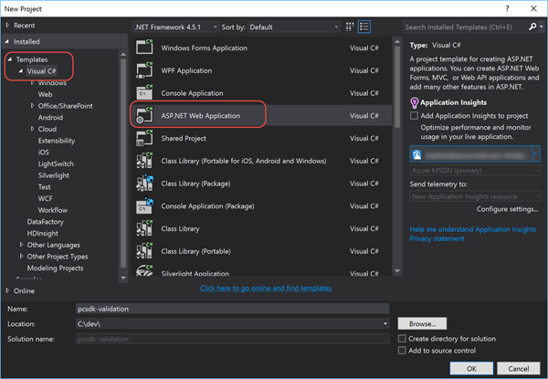
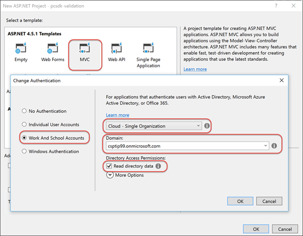

# Implementing Parameter Validation for Managing Customers

This Visual Studio based lab provides guidance on testing parameters prior to editing customers in the Partner Center SDK. This helps you to avoid errors when calling these APIs and avoid delays in provisioning services for customers. The lab includes customer address validation.


## Prerequisites

*Refer to the [Hands-On Lab Prerequisites](../hol-prereqs.md) for a full list of all prerequisites, additional details and additional resources.*

- Have access to the [Partner Center](https://partnercenter.microsoft.com) website & your partner ID.
- Have the login information for your CSP Integration Sandbox account.
- Developer environment with Visual Studio 2015 installed & configured.


## Exercise 1: Create ASP.NET MVC Application To List Customers

In this exercise you will create a new ASP.NET MVC application that will list all of the customers in your CSP partner / Integration Sandbox account.

### Create Visual Studio Project & Onboard Azure AD Application

Before coding up the project, you first need to create a new project that will also register an Azure AD application that your application will use to talk to the Partner Center SDK. Once it's created you then need to onboard the application in Partner Center dashboard.

1. Launch **Visual Studio 2015**.
1. Create a new ASP.NET MVC project:
  1. Select **File** :arrow_right: **New** :arrow_right: **Project**
  1. In the **New Project** dialog, from the **Visual C#** templates, select **ASP.NET Web Application**.
  1. Name the project **pcsdk_validation**.

    > Feel free to name the project anything, but keep in mind the namespace references in the code snippets in the remainder of the lab may not match... just ensure you use the correct namespace for your poject.

    

  1. In the **New ASP.NET Project** dialog:
    1. Select the template **MVC**
    1. Click the **Change Authentication** button and select **Word and School Accounts**.
    1. Set the authentication type to **Cloud - Single Organization**.
    1. Set the **Domain** to the domain of your CSP / Integration Sandbox account. *This is the domain of your CSP Azure AD tenant that Visual Studio will register an Azure AD application in when it creates the project.*

      > For instance, if your CSP account login is `admin@csptip99.onmicrosoft.com`, enter the domain `csptip99.onmicrosoft.com`.
    
    1. Check the box **Read directory data**.
    1. Click **OK** to accept the settings in the dialogs to save your changes.

    

      > Visual Studio may prompt you to login to your Azure AD tenant when you click **OK**. This is because Visual Studio must login to the Azure AD tenant to register the Azure AD application for you.

  Once the Visual Studio project has been created & the Azure AD application registered, the next step is to make sure the Azure AD application has the necessary permissions to talk to the Parter Center SDK. This process is referred to as *onboarding the application with Partner Center*.

  Partner Center will require you know the name of the application to onboard it but because you didn't enter a name, this can be challenging. Therefore you need to determine the name of the application in Azure AD that Visual Studio registered for you. For this use the Azure Management Portal.

1. Navigate to the **Azure Management Portal**: https://manage.windowsazure.com.
  1. Enter the credentials for your Azure Subscription that has access to manage your Integration Sandbox's AAD directory.

    > If you have not associated your Integration Sandbox AAD directory with an Azure subscription or this is not familiar, refer to this document: [Associating CSP Integration Sandbox Azure AD directory with Azure Subscription](../asscociate-aad-dir-azure-sub.md).

  1. In the left-hand navigation, scroll down and select the **Active Directory** menu item.
  1. Click on the name of the directory for your CSP Integration Sandbox.
  1. Click on the **Applications** menu item at the top of the page:

    

  1. Locate the application:
    1. Switch the **Show** toggle to **Applications my company owns**.
    1. In the **Search** box, enter the ID (GUID) of the Azure AD application Visual Studio registered. You will find this in the `web.config` file of the Visual Studio project under the `<appSetting>` named **ida:ClientId**.
    1. There should only be one app in the search results. Select it and verify the **Client ID** matches up with the ID in your ASP.NET project's `web.config`. Make a note of the name of this application.
1. Navigate to the Partner Center dashboard, **https://partnercenter.microsoft.com**, and login using your Partner account’s credentials.
1. In the left-hand navigation, select **Account Settings**.
1. In the left-hand navigation, select **API**.
1. On the API page, select the application that you found in the Azure Management Portal from the list of available options in the selector and click the **Register App** button.

  > Note: If an application is already registered, you will need to first click the **unregister** link in the top-right corner. This will then allow you to onboard your new Azure AD application.

Now verify you can login to the ASP.NET MVC web application you created.

1. Ensure the ASP.NET MVC web application project you created previously in this lab.
1. Update the ASP.NET application to load the OWIN stack to handle the authentication pipeline:
  1. Open the file `Startup.cs`.
  1. You need to tell the runtime to load this file when the application starts up. Add the following line just before the `namespace` declaration to add an assembly directive that will tell OWIN, on startup, to load this object which will call the `Configure()` method that calls the `ConfigureAuth()` method:

    ```c#
    [assembly: OwinStartup(typeof(pcsdk_validation.Startup))]
    ```

1. Test the application by pressing **[F5]**. 
  1. You should be taken to Azure AD & prompted to login. Use your CSP login credentials
  1. Upon a successful login, Azure AD will redirect you back to your ASP.NET MVC application's homepage. Notice in the top-right corner your login name is displayed.

At this point you have created the core ASP.NET MVC application, registered an Azure AD application, onboarded the Azure AD application with Partner Center and setup the ASP.NET MVC application to login to Azure AD.

### List All CSP Customers

In this exercise you will extend the ASP.NET MVC application to list all the customers in your CSP account using the Partner Center SDK.

1. Your ASP.NET MVC application is going to leverage the view model and repository patterns. The first step is to create a few entities.
  1. Within the `Models` folder, create a new file `MyCustomer.cs`.
  1. Ensure this file has the following two references in it:
  
    ```c#
    using System.ComponentModel;
    using System.ComponentModel.DataAnnotations;
    ```

  1. Add three classes to this file: `MyCustomer`, `MyBillingProfile` and `MyAddress`. You will find the code for all three classes in the [snippets](snippets) folder within this lab that you can copy-paste into the `MyCustomer.cs` file.
  
    Notice that each of these classes has properties that have been decorated with data annotations that the ASP.NET MVC engine will enforce when making edits.
    
The project will then need a customer repository that will do the work of interacting with the Partner Center SDK and translating Partner Center objects to and from our internal entity classes. But first we need to create two utility classes.

1. Add a settings helper to the project:
  1. Add a new folder, `Utilities`, to the root of the project.
  1. Add a new file, `SettingsHelper.cs` to the folder `Utilities`.
  1. Add the following reference to pull values from the `web.config`:

    ```c#
    using System.Configuration;
    ```

  1. Use the code in the [snippets/SettingsHelper.txt](snippets/SettingsHelper.txt) code snippet to implement this class. Looking through the class, notice it pulls values out of the `web.config` and also combines a few useful ones.

1. Create an authentication helper to obtain the necessary Partner Center authentication token:
Before you start coding, add some NuGet package dependencies that you will need in the project.

  1. Within the **Solution Explorer** tool pane, right-click the project and select **Manage NuGet Packages...**.
  1. Find and install the following package:
    - Microsoft.Store.PartnerCenter *v1.**
  1. Add a new file `PcAuthHelper.cs` to the `Utilites` folder.
  1. Add the following references to the top of the file:

    ```c#
    using Microsoft.IdentityModel.Clients.ActiveDirectory;
    using Microsoft.Store.PartnerCenter;
    using Microsoft.Store.PartnerCenter.Extensions;
    using pcsdk_validation.Models;
    ```

  1. Add the following single static method to the `PcAuthHelper.cs` file. This method will authenticate with Azure AD using the ADAL library and then use the token it obtains to obtain a Partner Center token. It then creates an instance of the `IPartner` Partner Center object and returns it to the caller. This way, our repository doesn't have to deal with any authentication logic.

    ```c#
    public static async Task<IAggregatePartner> GetPartnerCenterOps() {
      var signInUserId = ClaimsPrincipal.Current.FindFirst(ClaimTypes.NameIdentifier).Value;
      var userObjectId = new UserIdentifier(ClaimsPrincipal.Current.FindFirst(SettingsHelper.ClaimTypeObjectIdentifier).Value,
                                            UserIdentifierType.UniqueId);
      var clientCred = new ClientCredential(SettingsHelper.ClientId, SettingsHelper.ClientKey);

      // create auth context & login to AAD
      AuthenticationContext authContext = new AuthenticationContext(SettingsHelper.AadTenantAuthority, new ADALTokenCache(signInUserId));
      var adAuthResult = await authContext.AcquireTokenSilentAsync(SettingsHelper.PartnerCenterApiResourceId, clientCred, userObjectId);

      // login to partner center
      var adAuthToken = new AuthenticationToken(adAuthResult.AccessToken, adAuthResult.ExpiresOn);
      var pcCreds = await PartnerCredentials.Instance.GenerateByUserCredentialsAsync(SettingsHelper.ClientId, adAuthToken);
      var partnerOps = PartnerService.Instance.CreatePartnerOperations(pcCreds);

      return partnerOps;
    }
    ```

1. Now create a repository that will be used to work with customers.
  1. Add a new file `MyCustomerRepository.cs` to the `Models` folder.
  1. Add the following references to the file:

    ```c#
    using Microsoft.Store.PartnerCenter.Models;
    using Microsoft.Store.PartnerCenter.Models.Customers;
    using pcsdk_validation.Utilities;
    ```

  1. First add a method that will be used to get a list of customers from Partner Center:

    ```c#
    public static async Task<List<MyCustomer>> GetCustomers() {
      var partner = await PcAuthHelper.GetPartnerCenterOps();

      // get list of customers from PC
      var pcCustomers = partner.Customers.Get();
      // convert customers to local model
      var customers = new List<MyCustomer>();
      foreach (var pcCustomer in pcCustomers.Items) {
        var customer = ConvertCustomer(pcCustomer);
        customers.Add(customer);
      }

      return customers.ToList();
    }
    ```

  1. Then add a method that will get a single customer from Partner Center:

    ```c#
    public static async Task<MyCustomer> GetCustomer(string customerId) {
      var partner = await PcAuthHelper.GetPartnerCenterOps();

      // get customer from PC & convert to local model
      var pcCustomer = await partner.Customers.ById(customerId).GetAsync();
      var customer = ConvertCustomer(pcCustomer);

      return customer;
    }
    ```

  1. Next, add two versions of the same method that will convert Partner Center customers to our internal project's customer entity and back. To save typing you will find these methods, `ConvertCustomer()`, in the [snippets/ConvertCustomer.txt](snippets/ConvertCustomer.txt) file.

1. The last step before creating the controller and view is to create the view model that will be used to pass data back and forth between the two.
  1. Add a new file, `CustomerViewModel.cs` to the `Models` folder.
  1. Add the following references to the top of the file:

    ```c#
    using System.Web.Mvc;
    ```

  1. Add the following public properties and constructors to the view model class:

    ```c#
    public List<MyCustomer> Customers { get; set; }

    public MyCustomer Customer { get; set; }

    public IEnumerable<SelectListItem> Countries { get; set; }

    public IEnumerable<string> ValidationErrors { get; set; }
    public CustomerViewModel() {
      ValidationErrors = new List<string>();
    }

    public CustomerViewModel(MyCustomer customer) {
      Customer = customer;
      ValidationErrors = new List<string>();
    }
    ```

At this point the plumbing has been setup for you to now add a controller and view to list all customers on the site.

1. Add a new `CustomersController` controller:
  1. Right-click the **Controllers** folder and selecting **Add &raquo; Controller**.
  1. Select the scaffold option **MVC 5 Controller with read/write actions** and click **Add**.
  1. When prompted for a controller name, enter **CustomerController** and click **Add**.
  1. Add the following reference to the top of the file:

    ```c#
    using pcsdk_validation.Models;
    ```

1. Populate the `Index` action for the customer controller.
  1. Update the `Index` action to be async and to only accept calls by authenticated users by decorating it with the `[Authorize]` attribute.

    ```c#
    [Authorize]
    public async Task<ActionResult> Index() {
    }
    ```

  1. Then add the following lines that retrieve all the customers from your CSP account and returns them to the view using the view model:

    ```c#
    CustomerViewModel viewModel = new CustomerViewModel();
    viewModel.Customers = await MyCustomerRepository.GetCustomers();
    return View(viewModel);
    ```

1. Now add the view for the customer list.
  1. Within the `Index` action method, right-click and select **Add View**.
    1. Leave the **View name** as **Index**.
    1. Set the **Template** to **List**.
    1. Set the **Model class** to **CustomerViewModel**.
    1. Click **Add**.
  1. When the `Index.cshtml` file loads...
    1. Change the model on the first line to:

      ```razor
      @model pcsdk_validation.Models.CustomerViewModel
      ```

    1. Remove the `@Html.ActionLink("Create new", "Create")` line.
    1. Remove the `@Html.ActionLink("Details","Details", ...` line.
    1. Remove the `@Html.ActionLink("Delete","Delete", ...` line.
    1. Update the table header to list the following columns:

      ```html
      <tr>
        <th>Tenant ID</th>
        <th>Company Name</th>
        <th>Domain</th>
      </tr>
      ```

    1. Update the `@foreach` statement to show a list of customers and write out the fields for each customer:

      ```razor
      @foreach (var item in Model.Customers) {
        <tr>
          <td>@Html.DisplayFor(modelItem => item.TenantId)</td>
          <td>@Html.DisplayFor(modelItem => item.CompanyName)</td>
          <td>@Html.DisplayFor(modelItem => item.Domain)</td>
          <td>@Html.ActionLink("Edit", "Edit", new { id = item.Id })</td>
      ```

1. Finally add a navigation element to our Customers list. 
  1. Open the file `Views/Shared/_Layout.cshtml`.
  1. Locate the section with the navigation elements *Home*, *About*, and *Contact* and add the following link:

    ```razor
    <li>@Html.ActionLink("Customers", "Index", "Customer")</li>
    ```

1. Now test the application by pressing **F5**. You will be prompted to authenticate and then you should be presented with a list of all the customers in your CSP account.


## Exercise 2: Validate Customer Address on Edits

In this exercise you will extend the ASP.NET MVC application to edit a customer applying validation techniques and tools provided by the Partner Center SDK.

### Create Customer Validator Utility

First create a validator utility to help with checking if the address provided for a customer is valid according to the country selected.

1. Within the Visual Studio **Solution Explorer** tool window, right click the **Utilities** folder and select **Add &raquo; Class**.
  1. Set the name of the class to **CustomerValidator.cs**.
  1. Click **Add** to create the class.
1. Add the following references to the top of the class:

  ```c#
  using System.Threading.Tasks;
  using System.Text.RegularExpressions;
  using Microsoft.Store.PartnerCenter.Models.CountryValidationRules;
  using pcsdk_validation.Models;
  ```

1. Next, add to the new class some fields to store the customer, validation errors, validation rules and the constructors to create the class:

  ```c#
  public MyCustomer Customer { get; private set; }
  public List<string> ValidationErrors { get; private set; }
  private CountryValidationRules CountryValidationRules;

  private CustomerValidator(MyCustomer customer) {
    Customer = customer;
    ValidationErrors = new List<string>();
  }

  public static async Task<CustomerValidator> CreateAsync(MyCustomer customer) {
    var validator = new CustomerValidator(customer);

    // get country validation rules
    await validator.InitValidationRules(customer.BillingProfile.Address.Country);

    return validator;
  }
  ```

1. Create a private async method that's called by the constructor you just added to call the Partner Center API to get a list of all the validation rules for a country:

  ```c#
  private async Task InitValidationRules(string countryCode)
  {
    var partner = await PcAuthHelper.GetPartnerCenterOps();
    CountryValidationRules = await partner.CountryValidationRules.ByCountry(countryCode).GetAsync();
  }
  ```

1. Add a readonly property to trigger the validations. you will create these two validation methods in a moment:

  ```c#
  public bool IsValid
  {
    get
    {
      return ValidatePostalCode() && ValidateState();
    }
  }
  ```

1. Now create a method to validate the postal code provided. This method will check if the currently selected country requires a postal code. If the country requires a postal code, it uses the regular expression provided by the Partner Center API to ensure it is a valid postal code:

  ```c#
  public bool ValidatePostalCode()
  {
    bool result = true;

    // check if required...
    if (CountryValidationRules.IsPostalCodeRequired &&
        string.IsNullOrEmpty(Customer.BillingProfile.Address.PostalCode)) {
      result = false;
      ValidationErrors.Add("Postal code required for the country " + Customer.BillingProfile.Address.Country);
    }
    // if postal code format provided, then check if valid...
    if (!string.IsNullOrEmpty(CountryValidationRules.PostalCodeRegex)) {
      if (!Regex.IsMatch(Customer.BillingProfile.Address.PostalCode,
                          CountryValidationRules.PostalCodeRegex)) {
        result = false;
        ValidationErrors.Add("Postal code invalid for the country " + Customer.BillingProfile.Address.Country);
      }
    }

    return result;
  }
  ```

1. Create a method to validate if a state is required. This method will check if the specified country requires a state. If it does, it will use the list of options provided by the Partner Center SDK to ensure it is a valid state:

  ```c#
  public bool ValidateState()
  {
    bool result = true;

    // check if required...
    if (CountryValidationRules.IsStateRequired &&
        string.IsNullOrEmpty(Customer.BillingProfile.Address.State)) {
      result = false;
      ValidationErrors.Add("State is required for the country " + Customer.BillingProfile.Address.Country);
    }
    // if state options provided, check if matching one submitted
    if (CountryValidationRules.SupportedStatesList.Any()) {
      // find state
      var foundState = CountryValidationRules.SupportedStatesList.Any(x => x == Customer.BillingProfile.Address.State);
      if (!foundState) {
        result = false;
        ValidationErrors.Add("State provided is not valid for the country " + Customer.BillingProfile.Address.Country);
      }
    }

    return result;
  }
  ```

### Add Edit Actions and Views to Customer Controller

With the validator class created, now you can create the Edit actions to test it out.

1. An edittable view is going to use an antiforgery token to protect the web application. By default the unique ID for a user is not checked so you need to set it within the startup of the application:
  1. Open the `Global.asax.cs` file.
  1. Add the following references to the top of the file:

    ```c#
    using System.IdentityModel.Claims;
    using System.Web.Helpers;
    ```

  1. Add the following line to the existing `Application_Start()` method to configure the unique claim type identifier:

    ```c#
    AntiForgeryConfig.UniqueClaimTypeIdentifier = ClaimTypes.NameIdentifier.ToString();
    ```

1. Before implementing the controller, create a utility class that will provide a lookup to use in a dropdown selector for the edit page.
  1. Add a new folder to the project named **Services**.
  1. The list of possible countries are quite long, so the code to do this has been provided. Right-click the **Services** folder and select **Add &raquo Existing Item**. Select the file `CountryService.cs` found in the [snippets](snippets) folder within this lab and click **Add**.

    > Note: This file assumes you used the same project name & namespace when creating the project as this lab used. If not, you may need to make slight modifications to `using` statements and the namespace name to get it to build.

1. Within Visual Studio, open the `Controllers\CustomerController.cs` class.
  1. Locate the `Edit()` method used for HTTP GET operations. This method should not have any attribute decorations on it.
  1. Add the attribute decoration `[Authorize]` just before the method to make sure the user calling it is authenticated.
  1. Change the method signature to the following async signature:

    ```c#
    public async Task<ActionResult> Edit(string id)
    ```

  1. Add an if statement gate to check if an ID was specified in the URL. If not, it should redirect back to the index page for the controller:

    ```c#
    if (string.IsNullOrEmpty(id)) {
    } else {
    }
    ```

  1. Within the `else` part of the statement, add the following code to retrieve a customer and add it to the view model created in the last lab:

    ```c#
    CustomerViewModel viewModel = new CustomerViewModel();

    // fetch customer & add to viewmodel
    var customer = await MyCustomerRepository.GetCustomer(id);
    viewModel.Customer = customer;
    ```

  1. Next, add the following code to get a list of possible countries and bind it to the view model, finally returning the view model to the view.

    ```c#
    // add lookup to viewmodel
    var countries = await Services.CountryService.List();
    viewModel.Countries = countries.Select(x => new SelectListItem {
      Value = x.Iso2Code,
      Text = x.Name
    });

    return View(viewModel);
    ```

  Now create the view for the edit screen:

1. Right-click anywhere in the code view and select **Add View**.
  1. In the **Add View** dialog, select the following values:
    - **View Name**: Edit
    - **Template**: Edit
    - **Model Class**: CustomerViewModel
  1. Click **Add** to create the view.
  1. Within the view, set the `ViewBag.Title` to **Edit Customer**.
  1. Next, you need to update the view to show all the properties of the currently selected customer. There are a lot of fields to add, so to simply things look the `CustomerEditView.txt` in the [snippets](snippets) folder. Copy the contents of this file and insert them just after the line in the default view that writes out the validation summary.
  1. Now, add the following snippet immediately after the existing line that writes out the validation summary and immediatley before the code you just added to the view. This will write out all the validation messages that you will add when your custom code validates the customer:

    ```razor
    @if (Model.ValidationErrors.Any()) {
      <ul style="color:red">
        @foreach (var pcValidationError in Model.ValidationErrors) {
          <li>@pcValidationError</li>
        }
      </ul>
    }
    ```

  With the view complete, go back to the controller and handle the submission of the form.

1. Open the `CustomerController.cs` file.
  1. Locate the `Edit()` method used for HTTP POST operations. This method shoudl have the `[HttpPost]` attribute decoration on it.
  1. Add the attribute decoration `[Authorize]` just before the method to make sure the user calling it is authenticated.
  1. Update the method signature to be an async method:

    ```c#
    public async Task<ActionResult> Edit(CustomerViewModel viewModel) {
    ```

  1. Add the following code to the method. This will use the validator class previously created to validate the current customer. If there are any errors, it will add those to the view model for display in the view. Otherwise, upon success you can see where you would add the code to save the customer & redirect back to the index page:

    ```c#
    var validator = await Utilities.CustomerValidator.CreateAsync(viewModel.Customer);

    if (!validator.IsValid) {
      // set validation errors on view model
      viewModel.ValidationErrors = validator.ValidationErrors;

      // add lookups to viewmodel
      var countries = await Services.CountryService.List();
      viewModel.Countries = countries.Select(x => new SelectListItem {
        Value = x.Iso2Code,
        Text = x.Name
      });

      return View(viewModel);
    } else {
      // TODO add logic to save customer billing profile
      return RedirectToAction("Index");
    }
    ```

1. Now test the application by pressing **F5**. You will be prompted to authenticate and then you should be presented with a list of all the customers in your CSP account. 
1. Click the **Edit** link to view the details on a customer. Change the state and postal code to something invalid while the country it set to **United States of America**. Notice when you click the **Submit** button errors are displayed.

## Exercise 3: Validate United States Addresses

In this exercise you will extend the validation routine to United States Postal Service (USPS) API to validate if a specified address is valid or not. Other countries may have different address validation checks, but this exercise will focus on United States based addresses.

### Register an Account with the USPS

In order to use the USPS web tools you must first register for a free account.

1. Within a browser, navigate to https://www.usps.com/business/web-tools-apis/welcome.htm and follow the instructions to register for an account.
1. Once you receive your account credentials, make note of the username as you will need it later.
1. Take a look at the API **[City/State Lookup Web Tool](https://www.usps.com/business/web-tools-apis/address-information-api.htm)** and how to use it. That is the API that you will add to your project. 

### Add City + State Validation for Specified Postal Code

In this step you will extend the existing ASP.NET web application to check that the provided city and state are valid for the specified postal code when the country is set to the United States.

1. First, create an object that will be used to serialize the request to send to the API.
  1. Refer to the documentation to copy all the XML that is used in a request, or just copy the following code to the clipboard:
  
    ```xml
    <CityStateLookupRequest USERID="xxxxxxxx">
      <ZipCode ID="0">
        <Zip5>90210</Zip5>
      </ZipCode>
    </CityStateLookupRequest>
    ```

  1. Within Visual Studio, right-click the **Models** folder and select **Add &raquo; Class**.
    1. In the **Add New Item** dialog, select the template **Class** and name the file **CityStateLookupRequest.cs**.
  1. Delete the class that is added to the file by default leaving an empty namespace.
  1. Within Visual Studio, place the cursor within the empty namespace in the **CityStateLookupRequest.cs** file.
  1. Select **Edit &raquo; Paste Special &raquo; Paste XML as Classes**.
  1. Locate the class `CityStateLookupRequestZipCode`.
  1. Update the `zip5Field` type from a `uint` to a `string`.
  1. Update the property `Zip5` type from a `unit` to a `string`. 
1. Now create an object that will be used to deserialize the response received from the API.
  1. Refer to the documentation to copy all the XML that is used in a response, or just copy the following code to the clipboard:

    ```xml
    <CityStateLookupResponse>
      <ZipCode ID="0">
        <Zip5>90210</Zip5>
        <City>BEVERLY HILLS</City>
        <State>CA</State>
      </ZipCode>
    </CityStateLookupResponse>
    ```

  1. Within Visual Studio, right-click the **Models** folder and select **Add &raquo; Class**.
    1. In the **Add New Item** dialog, select the template **Class** and name the file **CityStateLookupResponse.cs**.
  1. Delete the class that is added to the file by default leaving an empty namespace.
  1. Within Visual Studio, place the cursor within the empty namespace in the **CityStateLookupResponse.cs** file.
  1. Select **Edit &raquo; Paste Special &raquo; Paste XML as Classes**.
1. Add the following references to the top of the **CustomerValidator.cs** file:

  ```c#
  using System.IO;
  using System.Net;
  using System.Xml.Serialization;
  ```

1. Add a new method to the `CustomerValidator` class that will validate the address:

  ```c#
  public bool ValidateAddress()
  {
    public result = true;
    
    return result;
  }
  ```

  1. Add the following code before the return statement to create the query request object. Make sure to set the username of the USPS account you created previously.

    ```c#
    // create request payload
    var zipLookup = new CityStateLookupRequest {
      USERID = "",
      ZipCode = new CityStateLookupRequestZipCode {
        ID = 0,
        Zip5 = this.Customer.BillingProfile.Address.PostalCode
      }
    };
    ```

  1. Next, add code to ceate the query URL to the USPS API:

    ```c#
    // build query
    XmlSerializer serializerRequest = new XmlSerializer(typeof(CityStateLookupRequest));
    var writer = new StringWriter();
    serializerRequest.Serialize(writer, zipLookup);
    var query = string.Format("http://production.shippingapis.com/ShippingAPI.dll?API=CityStateLookup&XML={0}", writer.ToString());
    ```
  
  1. Now add the following code to submit the request and extract the response:

    ```c#
    // submit request
    CityStateLookupResponse uspsResponse;
    var httpRequest = WebRequest.Create(query);
    using (var reader = new StreamReader(httpRequest.GetResponse().GetResponseStream())) {
      XmlSerializer serializerResponse = new XmlSerializer(typeof(CityStateLookupResponse));
      uspsResponse = (CityStateLookupResponse)serializerResponse.Deserialize(new StringReader(reader.ReadToEnd()));
    }
    ```

  1. Finally, add the following code to check if the city and state provided match the given postal code. If not, add validation errors and return false:

    ```c#
    // check if city & state match zip
    if (this.Customer.BillingProfile.Address.City != uspsResponse.ZipCode.City) {
      ValidationErrors.Add("City provided is not valid for the specified postal code " + Customer.BillingProfile.Address.PostalCode);
      result = false;
    }
    if (this.Customer.BillingProfile.Address.State != uspsResponse.ZipCode.State) {
      ValidationErrors.Add("State provided is not valid for the specified postal code " + Customer.BillingProfile.Address.PostalCode);
      result = false;
    }
    ```

1. Lastly, update the validation check property to add a call to the new method if the current customer's country is set to **US**. Update the code for the `IsValid` property to the following:

  ```c#
  public bool IsValid
  {
    get
    {
      // check postal code & state for all address...
      var result = ValidatePostalCode() && ValidateState();
      // if US, check city & state combo for zip
      if (this.Customer.BillingProfile.Address.Country == "US") {
        var addressResult = ValidateAddress();
        if (!addressResult) {
          result = false;
        }
      }
      return result;
    }
  }
  ```

1. Now test your work by pressing **F5**.
  1. When the site loads, select a customer to edit.
  1. Try providing an invalid state such as using the following information which should yield an error message:
    - **City**: Redmond
    - **State**: FL
    - **Postal Code**: 98052
  1. Now try providing an invalid city which should yield an error message:
    - **City**: Chicago
    - **State**: WA
    - **Postal Code**: 98052

Congratuations, you have completed this lab!