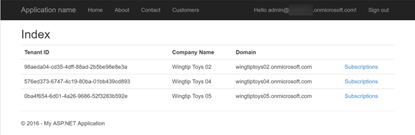

# Avoiding Common Order Submission Issues

CSP partners commonly run into issues when placing orders due to validation checks that occur in the commerce system. Many of these issues can be addressed prior to submitting an order by the partner. In this lab you will learn about some of these techniques.


## Prerequisites

*Refer to the [Hands-On Lab Prerequisites](../hol-prereqs.md) for a full list of all prerequisites, additional details and additional resources.*

- Have access to the [Partner Center](https://partnercenter.microsoft.com) website & your partner ID.
- Have the login information for your CSP Integration Sandbox account.
- Developer environment with Visual Studio 2015 installed & configured.


## Exercise 1: Create ASP.NET MVC Application To List Customers

In this exercise you will create a new ASP.NET MVC application that will list all of the customers in your CSP partner / Integration Sandbox account.

### Create Visual Studio Project & Onboard Azure AD Application

Before coding up the project, you first need to create a new project that will also register an Azure AD application that your application will use to talk to the Partner Center SDK. Once it's created you then need to onboard the application in Partner Center dashboard.

1. Launch **Visual Studio 2015**.
1. Create a new ASP.NET MVC project:
  1. Select **File** :arrow_right: **New** :arrow_right: **Project**
  1. In the **New Project** dialog, from the **Visual C#** templates, select **ASP.NET Web Application**.
  1. Name the project **pcsdk-order**.

    > Feel free to name the project anything, but keep in mind the namespace references in the code snippets in the remainder of the lab may not match... just ensure you use the correct namespace for your project.

    

  1. In the **New ASP.NET Project** dialog:
    1. Select the template **MVC**
    1. Click the **Change Authentication** button and select **Word and School Accounts**.
    1. Set the authentication type to **Cloud - Single Organization**.
    1. Set the **Domain** to the domain of your CSP / Integration Sandbox account. *This is the domain of your CSP Azure AD tenant that Visual Studio will register an Azure AD application in when it creates the project.*

      > For instance, if your CSP account login is `admin@csptip99.onmicrosoft.com`, enter the domain `csptip99.onmicrosoft.com`.
    
    1. Check the box **Read directory data**.
    1. Click **OK** to accept the settings in the dialogs to save your changes.

    

      > Visual Studio may prompt you to login to your Azure AD tenant when you click **OK**. This is because Visual Studio must login to the Azure AD tenant to register the Azure AD application for you.

  Once the Visual Studio project has been created & the Azure AD application registered, the next step is to make sure the Azure AD application has the necessary permissions to talk to the Parter Center SDK. This process is referred to as *onboarding the application with Partner Center*.

  Partner Center will require you know the name of the application to onboard it but because you didn't enter a name, this can be challenging. Therefore you need to determine the name of the application in Azure AD that Visual Studio registered for you. For this use the Azure Management Portal.

1. Navigate to the **Azure Management Portal**: https://manage.windowsazure.com.
  1. Enter the credentials for your Azure Subscription that has access to manage your Integration Sandbox's AAD directory.

    > If you have not associated your Integration Sandbox AAD directory with an Azure subscription or this is not familiar, refer to this document: [Associating CSP Integration Sandbox Azure AD directory with Azure Subscription](../asscociate-aad-dir-azure-sub.md).

  1. In the left-hand navigation, scroll down and select the **Active Directory** menu item.
  1. Click on the name of the directory for your CSP Integration Sandbox.
  1. Click on the **Applications** menu item at the top of the page:

    

  1. Locate the application:
    1. Switch the **Show** toggle to **Applications my company owns**.
    1. In the **Search** box, enter the ID (GUID) of the Azure AD application Visual Studio registered. You will find this in the `web.config` file of the Visual Studio project under the `<appSetting>` named **ida:ClientId**.
    1. There should only be one app in the search results. Select it and verify the **Client ID** matches up with the ID in your ASP.NET project's `web.config`. Make a note of the name of this application.
1. Navigate to the Partner Center dashboard, **https://partnercenter.microsoft.com**, and login using your Partner account’s credentials.
1. In the left-hand navigation, select **Account Settings**.
1. In the left-hand navigation, select **API**.
1. On the API page, select the application that you found in the Azure Management Portal from the list of available options in the selector and click the **Register App** button.

  > Note: If an application is already registered, you will need to first click the **unregister** link in the top-right corner. This will then allow you to onboard your new Azure AD application.

Now verify you can login to the ASP.NET MVC web application you created.

1. Ensure the ASP.NET MVC web application project you created previously in this lab.
1. Update the ASP.NET application to load the OWIN stack to handle the authentication pipeline:
  1. Open the file `Startup.cs`.
  1. You need to tell the runtime to load this file when the application starts up. Add the following line just before the `namespace` declaration to add an assembly directive that will tell OWIN, on startup, to load this object which will call the `Configure()` method that calls the `ConfigureAuth()` method:

    ```c#
    [assembly: OwinStartup(typeof(pcsdk-order.Startup))]
    ```

1. Test the application by pressing **[F5]**. 
  1. You should be taken to Azure AD & prompted to login. Use your CSP login credentials
  1. Upon a successful login, Azure AD will redirect you back to your ASP.NET MVC application's homepage. Notice in the top-right corner your login name is displayed.

At this point you have created the core ASP.NET MVC application, registered an Azure AD application, onboarded the Azure AD application with Partner Center and setup the ASP.NET MVC application to login to Azure AD.

### List All CSP Customers

In this exercise you will extend the ASP.NET MVC application to list all the customers in your CSP account using the Partner Center SDK.

1. Your ASP.NET MVC application is going to leverage the view model and repository patterns. The first step is to create a few entities.
  1. Within the `Models` folder, create a new file `MyCustomer.cs`.
  1. Ensure this file has the following two references in it:
  
    ```c#
    using System.ComponentModel;
    using System.ComponentModel.DataAnnotations;
    ```

  1. Add three classes to this file: `MyCustomer`, `MyBillingProfile` and `MyAddress`. You will find the code for all three classes in the [snippets](snippets) folder within this lab that you can copy-paste into the `MyCustomer.cs` file.
  
    Notice that each of these classes has properties that have been decorated with data annotations that the ASP.NET MVC engine will enforce when making edits.
    
The project will then need a customer repository that will do the work of interacting with the Partner Center SDK and translating Partner Center objects to and from our internal entity classes. But first we need to create two utility classes.

1. Add a settings helper to the project:
  1. Add a new folder, `Utilities`, to the root of the project.
  1. Add a new file, `SettingsHelper.cs` to the folder `Utilities`.
  1. Add the following reference to pull values from the `web.config`:

    ```c#
    using System.Configuration;
    ```

  1. Use the code in the [snippets/SettingsHelper.txt](snippets/SettingsHelper.txt) code snippet to implement this class. Looking through the class, notice it pulls values out of the `web.config` and also combines a few useful ones.

1. Create an authentication helper to obtain the necessary Partner Center authentication token:
Before you start coding, add some NuGet package dependencies that you will need in the project.

  1. Within the **Solution Explorer** tool pane, right-click the project and select **Manage NuGet Packages...**.
  1. Find and install the following package:
    - Microsoft.Store.PartnerCenter *v1.**
  1. Add a new file `PcAuthHelper.cs` to the `Utilites` folder.
  1. Add the following references to the top of the file:

    ```c#
    using Microsoft.IdentityModel.Clients.ActiveDirectory;
    using Microsoft.Store.PartnerCenter;
    using Microsoft.Store.PartnerCenter.Extensions;
    using System.Security.Claims;
    using System.Threading.Tasks;
    using pcsdk-order.Models;
    ```

  1. Add the following single static method to the `PcAuthHelper.cs` file. This method will authenticate with Azure AD using the ADAL library and then use the token it obtains to obtain a Partner Center token. It then creates an instance of the `IPartner` Partner Center object and returns it to the caller. This way, our repository doesn't have to deal with any authentication logic.

    ```c#
    public static async Task<IAggregatePartner> GetPartnerCenterOps() {
      var signInUserId = ClaimsPrincipal.Current.FindFirst(ClaimTypes.NameIdentifier).Value;
      var userObjectId = new UserIdentifier(ClaimsPrincipal.Current.FindFirst(SettingsHelper.ClaimTypeObjectIdentifier).Value,
                                            UserIdentifierType.UniqueId);
      var clientCred = new ClientCredential(SettingsHelper.ClientId, SettingsHelper.ClientKey);

      // create auth context & login to AAD
      AuthenticationContext authContext = new AuthenticationContext(SettingsHelper.AadTenantAuthority, new ADALTokenCache(signInUserId));
      var adAuthResult = await authContext.AcquireTokenSilentAsync(SettingsHelper.PartnerCenterApiResourceId, clientCred, userObjectId);

      // login to partner center
      var adAuthToken = new AuthenticationToken(adAuthResult.AccessToken, adAuthResult.ExpiresOn);
      var pcCreds = await PartnerCredentials.Instance.GenerateByUserCredentialsAsync(SettingsHelper.ClientId, adAuthToken);
      var partnerOps = PartnerService.Instance.CreatePartnerOperations(pcCreds);

      return partnerOps;
    }
    ```

1. Now create a repository that will be used to work with customers.
  1. Add a new file `MyCustomerRepository.cs` to the `Models` folder.
  1. Add the following references to the file:

    ```c#
    using Microsoft.Store.PartnerCenter.Models;
    using Microsoft.Store.PartnerCenter.Models.Customers;
    using System.Threading.Tasks;
    using pcsdk_order.Utilities;
    ```

  1. First add a method that will be used to get a list of customers from Partner Center:

    ```c#
    public static async Task<List<MyCustomer>> GetCustomers() {
      var partner = await PcAuthHelper.GetPartnerCenterOps();

      // get list of customers from PC
      var pcCustomers = partner.Customers.Get();
      // convert customers to local model
      var customers = new List<MyCustomer>();
      foreach (var pcCustomer in pcCustomers.Items) {
        var customer = ConvertCustomer(pcCustomer);
        customers.Add(customer);
      }

      return customers.ToList();
    }
    ```

  1. Then add a method that will get a single customer from Partner Center:

    ```c#
    public static async Task<MyCustomer> GetCustomer(string customerId) {
      var partner = await PcAuthHelper.GetPartnerCenterOps();

      // get customer from PC & convert to local model
      var pcCustomer = await partner.Customers.ById(customerId).GetAsync();
      var customer = ConvertCustomer(pcCustomer);

      return customer;
    }
    ```

  1. Next, add two versions of the same method that will convert Partner Center customers to our internal project's customer entity and back. To save typing you will find these methods, `ConvertCustomer()`, in the [snippets/ConvertCustomer.txt](snippets/ConvertCustomer.txt) file.

1. The last step before creating the controller and view is to create the view model that will be used to pass data back and forth between the two.
  1. Add a new file, `CustomerViewModel.cs` to the `Models` folder.
  1. Add the following references to the top of the file:

    ```c#
    using System.Web.Mvc;
    ```

  1. Add the following public properties and constructors to the view model class:

    ```c#
    public List<MyCustomer> Customers { get; set; }
    public MyCustomer Customer { get; set; }
    ```

At this point the plumbing has been setup for you to now add a controller and view to list all customers on the site.

1. Add a new `CustomersController` controller:
  1. Right-click the **Controllers** folder and selecting **Add &raquo; Controller**.
  1. Select the scaffold option **MVC 5 Controller with read/write actions** and click **Add**.
  1. When prompted for a controller name, enter **CustomerController** and click **Add**.
  1. Add the following references to the top of the file:

    ```c#
    using System.Threading.Tasks;
    using pcsdk_order.Models;
    ```

1. Populate the `Index` action for the customer controller.
  1. Update the `Index` action to be async and to only accept calls by authenticated users by decorating it with the `[Authorize]` attribute.

    ```c#
    [Authorize]
    public async Task<ActionResult> Index() {
    }
    ```

  1. Then add the following lines that retrieve all the customers from your CSP account and returns them to the view using the view model:

    ```c#
    CustomerViewModel viewModel = new CustomerViewModel();
    viewModel.Customers = await MyCustomerRepository.GetCustomers();
    return View(viewModel);
    ```

1. Now add the view for the customer list.
  1. Within the `Index` action method, right-click and select **Add View**.
    1. Leave the **View name** as **Index**.
    1. Set the **Template** to **List**.
    1. Set the **Model class** to **CustomerViewModel**.
    1. Click **Add**.
  1. When the `Index.cshtml` file loads...
    1. Change the model on the first line to:

      ```razor
      @model pcsdk_order.Models.CustomerViewModel
      ```

    1. Remove the `@Html.ActionLink("Create new", "Create")` line.
    1. Remove the `@Html.ActionLink("Details","Details", ...` line.
    1. Remove the `@Html.ActionLink("Edit","Edit", ...` line.
    1. Remove the `@Html.ActionLink("Delete","Delete", ...` line.
    1. Update the table header to list the following columns:

      ```html
      <tr>
        <th>Tenant ID</th>
        <th>Company Name</th>
        <th>Domain</th>
        <th></th>
      </tr>
      ```

    1. Update the `@foreach` statement to show a list of customers and write out the fields for each customer:

      ```razor
      @foreach (var item in Model.Customers) {
        <tr>
          <td>@Html.DisplayFor(modelItem => item.TenantId)</td>
          <td>@Html.DisplayFor(modelItem => item.CompanyName)</td>
          <td>@Html.DisplayFor(modelItem => item.Domain)</td>
          <td>@Html.ActionLink("Subscriptions", "Subscriptions", new { id = item.Id })</td>
      ```

1. Finally add a navigation element to our Customers list. 
  1. Open the file `Views/Shared/_Layout.cshtml`.
  1. Locate the section with the navigation elements *Home*, *About*, and *Contact* and add the following link:

    ```razor
    <li>@Html.ActionLink("Customers", "Index", "Customer")</li>
    ```

1. Now test the application by pressing **F5**. You will be prompted to authenticate and then you should be presented with a list of all the customers in your CSP account.


## Exercise 2: Addressing Limit Exceeded Errors

In this exercise you will take the .NET application you configured in the previous exercise in this hands-on-lab and update handle a common issue customers run into: identify and address the scenario when a customer tries to purchase licenses that exceed the max licenses allowed. Instead, take the approach to only sell as many licenses as they can possibly have for a given subscription.

> For this exercise you will need an existing customer that has at least one subscription for an office with a limited number of seats, for instance a subscription of **Office 365 Business Premium** with just a few licenses. If you don't have this, use the Partner Center dashboard site to set this up as the exercise in this HOL will assume you are editting an existing customer's subscriptions.

### List All Customer's Subscriptions

Add functionality to the ASP.NET MVC application to display a list of all the subscriptions, including licenses, for each customer.

1. Within Visual Studio add a new offer model class & repository:
  1. Right-click the **Models** folder and select **Add &raquo; New Item**.
  1. Select **Class** and set the new file's name to **MyOffer.cs**.
  1. Add the following public fields to class `MyOffer`:

    ```c#
    public string Id { get; set; }
    public bool IsAddon { get; set; }
    public string UnitType { get; set; }
    public string Name { get; set; }
    public string Description { get; set; }
    public int MinQuanity { get; set; }
    public int MaxQuantity { get; set; }
    public string Category { get; set; }
    ```
  1. Now create a new repository class: right-click the **Models** folder and select **Add &raquo; New Item**.
  1. Select **Class** and set the new file's name to **MyOfferRepository.cs**.
  1. Add the following references to the top of the `MyOfferRepository` class:

    ```c#
    using System.Threading.Tasks;
    using Microsoft.Store.PartnerCenter;
    using Microsoft.Store.PartnerCenter.Models.Subscriptions;
    using pcsdk_order.Utilities;
    ```
  1. The `MySubscriptionRepository` class will eventually contain quite a few methods that need to get access to the Partner Center SDK, specifically obtaining an instance of the `IPartner` interface. Therefore, add the following private field and method to the `MySubscriptionRepository` class that will either return an existing instance of the partner operation object or create an instance for later use:

    ```c#
    private static IAggregatePartner _partner;
    private static async Task<IAggregatePartner> GetPartner() {
      if (_partner == null) {
        _partner = await PcAuthHelper.GetPartnerCenterOps();
      }

      return _partner;
    }
    ```

  1. Now add the two following methods to retrieve a specific offer from the Partner Center SDK & convert it it from the SDK object to the object in our application:

    ```c#
    public static async Task<MyOffer> GetOffer(string offerId) {
      _partner = await GetPartner();

      // get offer from PC & convert to local model
      var pcOffer = await _partner.Offers.ByCountry("US").ById(offerId).GetAsync();
      var offer = await ConvertOffer(pcOffer);

      return offer;
    }

    private static async Task<MyOffer> ConvertOffer(Offer pcOffer) {
      var offer = new MyOffer {
        Id = pcOffer.Id,
        Category = pcOffer.Category.Id,
        UnitType = pcOffer.UnitType,
        Name = pcOffer.Name,
        Description = pcOffer.Description,
        IsAddon = pcOffer.IsAddOn,
        MinQuanity = pcOffer.MinimumQuantity,
        MaxQuantity = pcOffer.MaximumQuantity
      };

      return offer;
    }
    ```

1. Within Visual Studio add a new subscription model class & repository:
  1. Right-click the **Models** folder and select **Add &raquo; New Item**.
  1. Select **Class** and set the new file's name to **MySubscription.cs**.
  1. Add the following public fields to this new class `MySubscription`:

    ```c#
    public string Id { get; set; }
    public MyOffer Offer { get; set; }
    public int Quantity { get; set; }
    public string Status { get; set; }
    ```

  1. Now create a new repository class: right-click the **Models** folder and select **Add &raquo; New Item**.
  1. Select **Class** and set the new file's name to **MySubscriptionRepository.cs**.
  1. Add the following references to the top of the `MySubscriptionRepository` class:

    ```c#
    using System.Threading.Tasks;
    using Microsoft.Store.PartnerCenter;
    using Microsoft.Store.PartnerCenter.Models.Subscriptions;
    using pcsdk_order.Utilities;
    ```

  1. Just like the `MyOfferRespository` class, the `MySubscriptionRepository` class will eventually contain quite a few methods that need to get access to the Partner Center SDK, specifically obtaining an instance of the `IPartner` interface. Therefore, add the following private field and method to the `MySubscriptionRepository` class that will either return an existing instance of the partner operation object or create an instance for later use:

    ```c#
    private static IAggregatePartner _partner;
    private static async Task<IAggregatePartner> GetPartner() {
      if (_partner == null) {
        _partner = await PcAuthHelper.GetPartnerCenterOps();
      }

      return _partner;
    }
    ```

  1. Now add the following method to get a list of all subscriptions for a specific customer as well as a specific subscription:

    ```c#
    public static async Task<List<MySubscription>> GetSubscriptions(string customerId) {
      var pcSubscriptions = await (await GetPartner()).Customers.ById(customerId).Subscriptions.GetAsync();

      List<MySubscription> subscriptions = new List<MySubscription>();

      foreach(var pcSubscription in pcSubscriptions.Items) {
        subscriptions.Add(await ConvertSubscription(pcSubscription));
      }

      return subscriptions;
    }

    public static async Task<MySubscription> GetSubscription(string customerId, string subscriptionId) {
      var pcSubscription = await (await GetPartner()).Customers.ById(customerId).Subscriptions.ById(subscriptionId).GetAsync();

      return await ConvertSubscription(pcSubscription);
    }
    ```

  1. Add the following private method to conver Partner Center objects to objects in your ASP.NET application:

    ```c#
    private static async Task<MySubscription> ConvertSubscription(Subscription pcSubscription) {
      var subscription = new MySubscription {
        Id = pcSubscription.Id,
        Offer = await MyOfferRepository.GetOffer(pcSubscription.OfferId),
        Quantity = pcSubscription.Quantity,
        Status = pcSubscription.Status.ToString()
      };

      return subscription;
    }
    ```

1. Next, create a view model class that the controller will populate and return to the view.
  1. Right-click the **Models** folder and select **Add &raquo; New Item**.
  1. Select **Class** and set the new file's name to **CustomerSubscriptionViewModel.cs**.
  1. Add the following members to the `CustomerSubscriptionViewModel` class:

    ```c#
    public MyCustomer Customer { get; set; }
    public List<MySubscription> CustomerSubscriptions { get; set; }
    ```

1. Update the `CustomerController` to show the subscriptions for a specific customer:
  1. Add the following method to the **CustomerController** file to list all subscriptions for the specified customer:

    ```c#
    [Authorize]
    public async Task<ActionResult> Subscriptions(string id) {
      // if no customer provided, redirect to list 
      if (string.IsNullOrEmpty(id)) {
        return RedirectToAction("Index");
      } else {
        CustomerSubscriptionViewModel viewModel = new CustomerSubscriptionViewModel();

        // get customer & add to viewmodel
        var customer = await MyCustomerRepository.GetCustomer(id);
        viewModel.Customer = customer;

        // get all subscriptions customer currently has
        var subscriptions = await MySubscriptionRepository.GetSubscriptions(id);
        viewModel.CustomerSubscriptions = subscriptions.OrderBy(s => s.Offer.Name).ToList();

        return View(viewModel);
      }
    }
    ```

1. Now add the view for the subscription list.
  1. Within the `Index` action method, right-click and select **Add View**.
    1. Leave the **View name** as **Index**.
    1. Set the **Template** to **List**.
    1. Set the **Model class** to **CustomerSubscriptionViewModel**.
    1. Click **Add**.
  1. When the `Index.cshtml` file loads...
    1. Change the model on the first line to:

      ```razor
      @model pcsdk_order.Models.CustomerSubscriptionViewModel
      ```

    1. Update the page title to list the customer name in the header:

      ```razor
      <h2>@Model.Customer.CompanyName - Subscriptions</h2>
      ```

    1. Remove the remaining markup in the view file as you will write it by hand.
    1. Add the following code for the header part of the table that will display all the customer's subscriptions:

      ```razor
      <table class="table">
        <tr>
          <th>Subscription</th>
          <th>Quantity</th>
          <th>Status</th>
          <th></th>
        </tr>
      </table>
      ```

    1. Now, add a `foreach` loop to the body of the table to write out all subscriptions

      ```razor
      @foreach (var item in Model.CustomerSubscriptions) {
        <tr>
          <td>
            @Html.HiddenFor(modelItem => item.Id)
            <strong>@Html.DisplayFor(modelItem => item.Offer.Name)</strong><br />
            <em>@Html.DisplayFor(modelItem => item.Offer.Description)</em>
          </td>
          <td>@Html.DisplayFor(modelItem => item.Quantity)</td>
          <td>@Html.DisplayFor(modelItem => item.Status)</td>
          <td></td>
        </tr>
      }
      ```

1. Test the web application to ensure you can see a list of subscriptions for the selected customer:
  1. Press **[F5]** to start the application.
  1. After logging in, click the **Customers** link in the top navigation to see a list of customers:

    

  1. Click the **Subscriptions** link for one of the customers to see a list of subscriptions:

    

  1. Now that the application is working, add functionality to add licenses to an existing subscription.


### Add Licenses to Subscription

1. Update the list of subscriptions to show a link to add additional licenses if the offer allows for it:
  1. Open the `Subscriptions.cshtml` file in Visual Studio.
  1. Locate the empty table cell in the `foreach` loop and replace it with the following:

    ```razor
    <td>
      @if (item.Offer.UnitType == "Licenses") {
        if (item.Offer.MaxQuantity > item.Quantity) {
          @Html.ActionLink("add licenses", "AddLicense", "Customer",
                  new {
                    customerId = Model.Customer.Id,
                    subscriptionId = item.Id
                  }, null)
        }
      }
    </td>
    ```

1. Add a new view model class for this route:
  1. Within Visual Studio, right-click the **Models** folder and select **Add &raquo; New Item**.
  1. Select **Class** and set the new file's name to **CustomerAddLicenseViewModel.cs**.
  1. Add the following reference to the top of the `CustomerAddLicenseViewModel` class:

    ```c#
    using System.Web.Mvc;
    ```

  1. Now add the following members to the `CustomerAddLicenseViewModel` class:

    ```c#
    public MyCustomer Customer { get; set; }
    public MySubscription CustomerSubscription { get; set; }
    public string LicensesToAdd { get; set; }
    public IEnumerable<SelectListItem> AvailableLicenseQuantity { get; set; }
    public CustomerAddLicenseViewModel() {
      AvailableLicenseQuantity = new List<SelectListItem>();
    }
    ```

1. Add a new method to the `CustomerController` to handle the case when a user navigates to the page to add licenses

  Notice that you will create options for only the number of licenses that the customer can add to the subscription which it supports. This will protect you from hitting the exception when trying to add too many licenses to a subscription. Note that it also limits adding only 1000 licenses at a time. 

  ```c#
  [Authorize]
  [HttpGet]
  public async Task<ActionResult> AddLicense(string customerId, string subscriptionId) {
    // if no ids provided, redirect to list 
    if (string.IsNullOrEmpty(customerId) || string.IsNullOrEmpty(subscriptionId)) {
      return RedirectToAction("Index");
    } else {
      CustomerAddLicenseViewModel viewModel = new CustomerAddLicenseViewModel();

      // get customer & add to viewmodel
      var customer = await MyCustomerRepository.GetCustomer(customerId);
      viewModel.Customer = customer;

      // get subscription
      var subscription = await MySubscriptionRepository.GetSubscription(customerId, subscriptionId);
      viewModel.CustomerSubscription = subscription;

      // create lookup for licenses available for purchase
      List<SelectListItem> dropDownItems = new List<SelectListItem>();
      for (int index = 1; index + subscription.Quantity <= subscription.Offer.MaxQuantity; index++) {
        dropDownItems.Add(new SelectListItem {
          Text = string.Format("add {0} more license(s) - total of {1}", index, subscription.Quantity + index),
          Value = index.ToString()
        });
        // limit adding only 1000 licenses at a time
        if (index == 1000) {
          break;
        }
      }
      viewModel.AvailableLicenseQuantity = dropDownItems;

     0 return View(viewModel);
    }
  }
  ```

1. Next, add a method to the `CustomerController` to handle when the form is submitted:

  ```c#
  [Authorize]
  [HttpPost]
  public async Task<ActionResult> AddLicense(string customerId, string subscriptionId, string licensesToAdd) {
    // if no ids provided, redirect to list 
    if (string.IsNullOrEmpty(customerId) || string.IsNullOrEmpty(subscriptionId) || string.IsNullOrEmpty(licensesToAdd)) {
      return RedirectToAction("Index");
    } else {
      // get customer
      var customer = await MyCustomerRepository.GetCustomer(customerId);

      // get subscription
      var subscription = await MySubscriptionRepository.GetSubscription(customerId, subscriptionId);

      // update quantity and save
      subscription.Quantity += Convert.ToInt16(licensesToAdd);
      await MySubscriptionRepository.UpdateSubscription(customerId, subscription);


      return RedirectToAction("Index");
    }
  }
  ```

1. Finally, add a method to the `MySubscriptionRespository` class to handle the action taken in this method:

  ```c#
  public static async Task UpdateSubscription(string customerId, MySubscription subscription) {
    // get subscription
    var pcSubscription = await(await GetPartner()).Customers.ById(customerId).Subscriptions.ById(subscription.Id).GetAsync();
    // update quantity 
    pcSubscription.Quantity = subscription.Quantity;
    // update subscription
    await (await GetPartner()).Customers.ById(customerId).Subscriptions.ById(subscription.Id).PatchAsync(pcSubscription);
  }
  ```

1. The new route needs a view to present the view model.
  1. In the `CustomerController` class, within the `AddLicense` method, right-click and select **Add View**.
    1. Leave the **View name** as **Index**.
    1. Set the **Template** to **Empty**.
    1. Set the **Model class** to **CustomerAddLicenseViewModel**.
    1. Click **Add**.
  1. When the `Index.cshtml` file loads...
    1. Change the title of the page to:

      ```html
      <h2>Add Licenses to Existing Subscription</h2>
      ```

    1. Add a new form with two hidden fields:

      ```razor
      @using (Html.BeginForm()) {
        @Html.AntiForgeryToken()

        @Html.Hidden("customerId", Model.Customer.Id)
        @Html.Hidden("subscriptionId", Model.CustomerSubscription.Id)
      }
      ```

    1. Add the following to the form to display the current subscription and total licenses the customer currently has. It will then display a drop down list for all options they can add licenses for:

      ```razor
      <div>
        <h3>Current Subscription: @Html.DisplayFor(model => model.CustomerSubscription.Offer.Name)</h3>
        <h3>Current Number of Licenses: @Html.DisplayFor(model => model.CustomerSubscription.Quantity)</h3>
        <hr />
        <h4>How many licenses do you want to add?</h4>
        @Html.DropDownListFor(model => model.LicensesToAdd, Model.AvailableLicenseQuantity)
      </div>
      <p>
        <input type="submit" value="Add licenses" class="btn btn-primary" /><br />
      </p>
      ```

1. An edittable view is going to use an antiforgery token to protect the web application. By default the unique ID for a user is not checked so you need to set it within the startup of the application:
  1. Open the `Global.asax.cs` file.
  1. Add the following references to the top of the file:

    ```c#
    using System.IdentityModel.Claims;
    using System.Web.Helpers;
    ```

  1. Add the following line to the existing `Application_Start()` method to configure the unique claim type identifier:

    ```c#
    AntiForgeryConfig.UniqueClaimTypeIdentifier = ClaimTypes.NameIdentifier.ToString();
    ```

1. Test the web application to ensure you can see a list of subscriptions for the selected customer:
  1. Press **[F5]** to start the application.
  1. After logging in, click the **Customers** link in the top navigation to see a list of customers:

    

  1. Click the **Subscriptions** link for one of the customers to see a list of subscriptions. This time you should see an option to add licenses to subscriptions that are not of type Azure:

    

  1. Click the **add licenses** link for one of the subscriptions with a max limit. You will then be presented with a form where you can select licenses to add to the subscription. Select a low number, keeping in mind how many licenses they started with and how many you are adding, and click the **add licenses** button:

    

  1. Navigate back to the list of subscriptions for this customer to see how the license count has increased.

## Exercise 3: Transitioning an Office 365 Subscription

In the case of the previous scenario, one option is for a customer to upgrade an existing license from one to another to avoid the limit exceeded error returned by the Partner Center API. However what happens when a customer needs more licenses than a subscription supports? In this case they need to upgrade their license from one type to another type, such as small business to enterprise. In this exercise you will address this scenario and demonstrate how to upgrade a license, also referred to as *transitioning*.

1. First, create a new upgrade class that will be used in our web application:
  1. Right-click the **Models** folder and select **Add &raquo; New Item**.
  1. Select **Class** and set the new file's name to **MyUpgrade.cs**.
  1. Add the following public fields and constructor to this new class `MyUpgrade`:

    ```c#
    public string TargetOfferId { get; set; }
    public string TargetOfferName { get; set; }
    public string TargetOfferDescription { get; set; }
    public int Quantity { get; set; }
    public string UpgradeType { get; set; }

    public MyUpgrade() {
      Quantity = 0;
      UpgradeType = "None";
    }
    ```

1. With the upgrade class created, now update the `MySubscriptionRepository` class to support upgrade actions.
  1. Add the following method to the `MySubscriptionRepository` class in the **MySubscriptionRepository.cs** file to get a list of all the available upgrade options for a specific subscription:

    ```c#
    public static async Task<List<MyUpgrade>> GetUpgradeOptions(string customerId, string subscriptionId) {
      var pcSubscription = (await GetPartner()).Customers.ById(customerId).Subscriptions.ById(subscriptionId);
      var pcUpgrades = await pcSubscription.Upgrades.GetAsync();

      List<MyUpgrade> upgrades = new List<MyUpgrade>();

      foreach(var pcUpgrade in pcUpgrades.Items) {
        upgrades.Add(await ConvertUpgradeOffer(pcUpgrade));
      }

      return upgrades;
    }
    ```

  1. Next, add the following method to convert the upgrade object from the Partner Center SDK to our internal class:

    ```c#
    private static async Task<MyUpgrade> ConvertUpgradeOffer(Upgrade pcUpgrade) {
      var upgrade = new MyUpgrade {
        TargetOfferId = pcUpgrade.TargetOffer.Id,
        TargetOfferName = pcUpgrade.TargetOffer.Name,
        TargetOfferDescription = pcUpgrade.TargetOffer.Description,
        Quantity = pcUpgrade.Quantity,
        UpgradeType = pcUpgrade.UpgradeType.ToString()
      };

      return upgrade;
    }
    ```

  1. Lastly, add the following method to take an upgrade option and submit it to Partner Center:

    ```c#
    public static async Task UpgradeSubscrption(string customerId, string subscriptionId, string targetOfferId, string targetUpgradeType) {
      var pcSubscription = (await GetPartner()).Customers.ById(customerId).Subscriptions.ById(subscriptionId);
      var pcUpgrades = await pcSubscription.Upgrades.GetAsync();

      // get the one selected
      var upgradeSelected = pcUpgrades.Items.First(upgrade => (upgrade.TargetOffer.Id == targetOfferId && upgrade.UpgradeType.ToString() == targetUpgradeType));
      // upgrade
      var result = pcSubscription.Upgrades.Create(upgradeSelected);
      // handle issues
    }
    ```

1. Create a new view model class that will be used to pass upgrade options to the view from the customer controller.
  1. Right-click the **Models** folder and select **Add &raquo; New Item**.
  1. Select **Class** and set the new file's name to **CustomerSubscriptionUpgradeViewModel.cs**.
  1. Add the following reference to the top of the **CustomerSubscriptionUpgradeViewModel.cs** file:

    ```c#
    using System.Web.Mvc;
    ```

  1. Add the following public fields and constructor to this new class `CustomerSubscriptionUpgradeViewModel`:

    ```c#
    public MyCustomer Customer { get; set; }

    public MySubscription CustomerSubscription { get; set; }

    public string UpgradeOfferSelected { get; set; }

    public IEnumerable<SelectListItem> UpgradeOptions { get; set; }

    public CustomerSubscriptionUpgradeViewModel() {
      UpgradeOptions = new List<SelectListItem>();
    }
    ```

1. Now you need to update the `CustomerController` to have a HTTP GET & POST handler for the upgrades.
  1. Open the **CustomerController.cs** file in Visual Studio.
  1. Add the following method to the `CustomerController` class. This method will handle creating a view model with all upgrade options the user can pick from:

    ```c#
    [Authorize]
    [HttpGet]
    public async Task<ActionResult> UpgradeSubscription(string customerId, string subscriptionId) {
      // if no ids provided, redirect to list 
      if (string.IsNullOrEmpty(customerId) || string.IsNullOrEmpty(subscriptionId)) {
        return RedirectToAction("Index");
      } else {
        CustomerSubscriptionUpgradeViewModel viewModel = new CustomerSubscriptionUpgradeViewModel();

        // get customer & add to viewmodel
        var customer = await MyCustomerRepository.GetCustomer(customerId);
        viewModel.Customer = customer;

        // get subscription
        var subscription = await MySubscriptionRepository.GetSubscription(customerId, subscriptionId);
        viewModel.CustomerSubscription = subscription;

        // get upgrade options
        var upgrades = await MySubscriptionRepository.GetUpgradeOptions(customerId, subscriptionId);
        List<SelectListItem> upgadeOptions = new List<SelectListItem>();
        foreach (var upgrade in upgrades) {
          upgadeOptions.Add(new SelectListItem {
            Text = string.Format("Upgrade to offer '{0}' - Option: {1}", upgrade.TargetOfferName, upgrade.UpgradeType),
            Value = string.Format("{0}|{1}", upgrade.TargetOfferId, upgrade.UpgradeType)
          });
        }
        viewModel.UpgradeOptions = upgadeOptions;

        return View(viewModel);
      }
    }
    ```

  1. Finally, add the following method to handle the HTTP POST when the upgrade form is submitted:

    ```c#
    [Authorize]
    [HttpPost]
    public async Task<ActionResult> UpgradeSubscription(string customerId, string subscriptionId, string upgradeOfferSelected) {
      // if no ids provided, redirect to list 
      if (string.IsNullOrEmpty(customerId) || string.IsNullOrEmpty(subscriptionId) || string.IsNullOrEmpty(upgradeOfferSelected)) {
        return RedirectToAction("Index");
      } else {
        // get customer
        var customer = await MyCustomerRepository.GetCustomer(customerId);

        // get subscription
        var subscription = await MySubscriptionRepository.GetSubscription(customerId, subscriptionId);

        // split upgrade up
        var targetOfferId = upgradeOfferSelected.Split("|".ToCharArray())[0];
        var targetUpgradeType = upgradeOfferSelected.Split("|".ToCharArray())[1];

        // upgrade the subscription
        await MySubscriptionRepository.UpgradeSubscrption(customerId, subscriptionId, targetOfferId, targetUpgradeType);

        return RedirectToAction("Index");
      }

    }
    ```

1. Now you need to make some updates to a few existing views before creating a new view.
  1. Open the **Subscriptions.cshtml** view.
    1. Locate the `if` statement that checks if the current offer's max quantity is greater than the current subscriptions quantity.
    1. This `if` statement does not have an `else` block... add one that will give the user an option to upgrade the subscription if they have maxed out their available licenses:

      ```c#
      } else {
        @Html.Raw("Max license limit reached, would you like to ") @Html.ActionLink("transition", "UpgradeSubscription", "Customer", new { customerId = Model.Customer.Id, subscriptionId = item.Id }, null) @Html.Raw(" to another license?")
      }
      ```
  1. Open the **AddLicense.cshtml** view.
    1. Locate the submit button at the end of the view.
    1. Add the following HTML block just before the `<p>` that encloses the submit button:

      ```c#
      <p>
        Need more licenses? The subscription you are currently on only allows up to @Html.DisplayFor(model => model.CustomerSubscription.Offer.MaxQuantity) licenses.<br />
        If you need more you may need to @Html.ActionLink("transition your existing subscription to a new subscription", "UpgradeSubscription", "Customer", new { customerId = Model.Customer.Id, subscriptionId = Model.CustomerSubscription.Id }, null).
      </p>
      ```

1. Now add the view for upgrading a subscription.
  1. Go back to the **CustomerController.cs** file and locate the HTTP GET method for the `UpgradeSubscription()` method.
  1. Within the `UpgradeSubscription` action method, right-click and select **Add View**.
    1. Leave the **View name** as **Index**.
    1. Set the **Template** to **Empty**.
    1. Set the **Model class** to **CustomerSubscriptionUpgradeViewModel**.
    1. Click **Add**.
  1. When the `UpgradeSubscription.cshtml` file loads..
  1. Add the following code to the view. This will create a new form, add a few hidden fields and add a dropdown list for the user to select what upgrade they want to perform:

    ```c#
    <h2>Transition Offer</h2>

    @using (Html.BeginForm()) {
      @Html.AntiForgeryToken()

      @Html.Hidden("customerId", Model.Customer.Id)
      @Html.Hidden("subscriptionId", Model.CustomerSubscription.Id)
      
      <h3>Current Subscription: @Html.Display(Model.CustomerSubscription.Offer.Name)</h3>

      <div>
        <h4>Select an upgrade option to perform</h4>
        <hr />
        @Html.DropDownListFor(model => model.UpgradeOfferSelected, Model.UpgradeOptions)
      </div>
      <p>
        <input type="submit" value="upgrade subscription" class="btn btn-primary" /><br />
      </p>
      <p>
        @Html.ActionLink("Back to List", "Index")
      </p>
    }
    ```

1. Test the web application to ensure you can see a list of subscriptions for the selected customer:
  1. Press **[F5]** to start the application.
  1. After logging in, click the **Customers** link in the top navigation to see a list of customers:

    

  1. Click the **Subscriptions** link for one of the customers to see a list of subscriptions. Click the **add licenses** link next to one of the subscriptions that can be upgraded, such as **Office 365 Business Premium**

    

  1. On the **Add License to Existing Subscription** page, click the link **transition your existing subscription to a new subscription**.
  1. Select one of the upgrade options and click the **upgrade subscription** button.

    

  1. When the upgrade completes, it will take you back to the main custom list. Select the customer to view a list of the subscriptions. You will see the old subscription is now marked as suspended and replaced with the new active subscription: 

    
