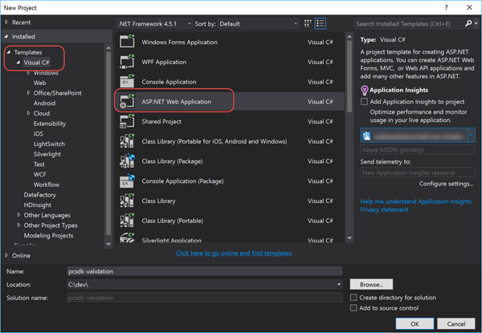
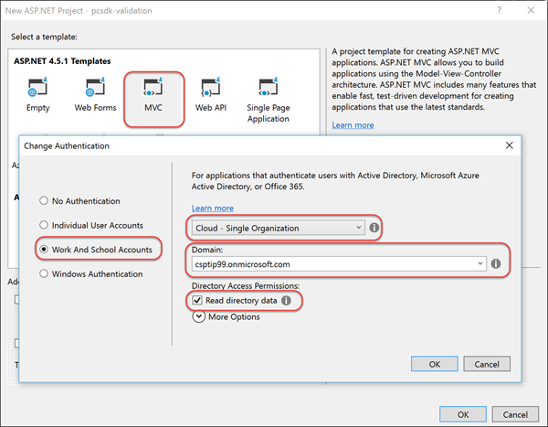
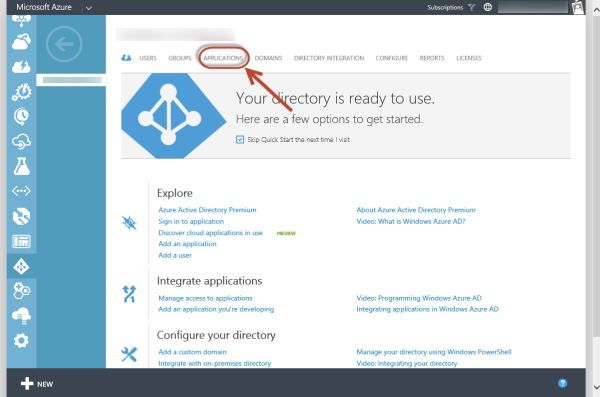
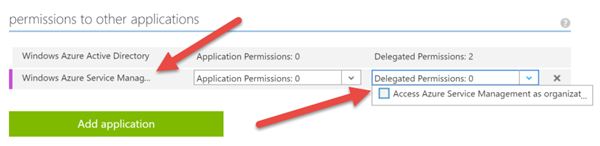
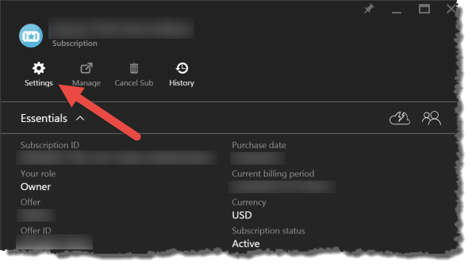
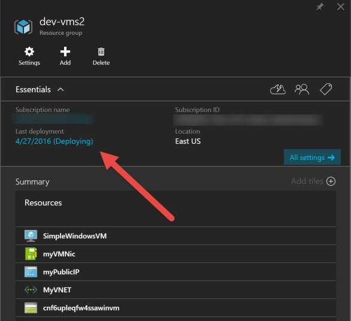

# Hands On Lab #5 - Adding Resources to a new Azure Subscription

The Partner Center SDK provides abilities to order licenses for Office 365 and other license-based services offered by Microsoft. Partners can also use the SDK to create Azure subscriptions, but creating and management of resources in the Azure subscription must be done using the Azure REST APIs.

This lab shows how you would create Azure resources using the Azure Resource Manager (ARM) to an Azure subscription. It shows how to ensure that the Azure subscription is properly provisioned prior to resource provisioning and how to set appropriate access permissions on the Azure subscription for programmatic resource creation.

> You can find a completed version of the solution that you would have at the conclusion of the lab in the [completed](completed) folder. Any settings, such as IDs, passwords, keys and other partner-specific values have been removed from the completed solution, but if you run into trouble you can use the final solution as a template to compare your work against if you have trouble.

> **NOTE:** This lab focuses on submitting requests to the Azure Management REST API. It does not include much / any input validation on the forms created to ensure the values submitted by the user are correct. For instance, it does not check to ensure the Azure resource group name meets the naming requirements by Azure. This is so the person working through this lab can focus on the task at hand and not general ASP.NET best practices development.

## Prerequisites

*Refer to the [Hands-On Lab Prerequisites](../hol-prereqs.md) for a full list of all prerequisites, additional details and additional resources.*

- Have access to the [Partner Center](https://partnercenter.microsoft.com) website & your partner ID.
- Have the login information for your CSP Integration Sandbox account.
- Have the login information for a valid Azure subscription for a user in the subscription's *Owner* or *Contributor* role.
- Developer environment with Visual Studio 2015 installed & configured.


## Exercise 1: Create ASP.NET Application and Configure Authentication with Azure Active Directory

In this exercise you will create a new ASP.NET MVC application. You will then configure an Azure AD application with the necessary permissions to call the Azure REST APIs. At the end of this exercise you will write the code to obtain an access token to call the Azure REST APIs.

### Create Visual Studio Project

Before coding up the project, you first need to create a new project that will also register an Azure AD application that your application will use to talk to the Partner Center SDK. Once it's created you then need to onboard the application in Partner Center dashboard.

1. Launch **Visual Studio 2015**.
1. Create a new ASP.NET MVC project:
  1. Select **File** :arrow_right: **New** :arrow_right: **Project**
  1. In the **New Project** dialog, from the **Visual C#** templates, select **ASP.NET Web Application**.
  1. Name the project **azurearm**.

    > Feel free to name the project anything, but keep in mind the namespace references in the code snippets in the remainder of the lab may not match... just ensure you use the correct namespace for your project.

    

  1. In the **New ASP.NET Project** dialog:
    1. Select the template **MVC**
    1. Click the **Change Authentication** button and select **Word and School Accounts**.
    1. Set the authentication type to **Cloud - Single Organization**.
    1. Set the **Domain** to the domain of your CSP / Integration Sandbox account. *This is the domain of your CSP Azure AD tenant that Visual Studio will register an Azure AD application in when it creates the project.*

      > For instance, if your CSP account login is `admin@csptip99.onmicrosoft.com`, enter the domain `csptip99.onmicrosoft.com`.
    
    1. Check the box **Read directory data**.
    1. Click **OK** to accept the settings in the dialogs to save your changes.

    

      > Visual Studio may prompt you to login to your Azure AD tenant when you click **OK**. This is because Visual Studio must login to the Azure AD tenant to register the Azure AD application for you.

### Update Azure AD Application's Permissions

In the creation of the ASP.NET web application, Visual Studio created a new application in Azure AD. This application has minimal rights, enough to leverage as the authentication provider for the web application. However this application will also need permissions to call the Azure Service Management REST APIs to provision resources using the ARM model.

> At the time of writing this lab, Azure Active Directory is not available in the latest Azure portal at https://portal.azure.com so for now, you need to use the previous portal to manage Azure AD applications.

1. Navigate to the **Azure Management Portal**: https://manage.windowsazure.com.
  1. Enter the credentials for your Azure Subscription.
1. In the left-hand navigation, scroll down and select the **Active Directory** menu item.
1. Click on the name of the directory for your Azure AD tenant.
1. Click on the **Applications** menu item at the top of the page:

  

1. Locate the application:
  1. Switch the **Show** toggle to **Applications my company owns**.
  1. In the **Search** box, enter the ID (GUID) of the Azure AD application Visual Studio registered. You will find this in the `web.config` file of the Visual Studio project under the `<appSetting>` named **ida:ClientId**.
  1. There should only be one app in the search results. Select it and verify the **Client ID** matches up with the ID in your ASP.NET project's `web.config`. Make a note of the name of this application.
1. Once you have located the application, select it.
1. Update the application's permissions:
  1. Select the **Configure** menu item at the top of the page.
  1. Scroll to the bottom to the section **Permissions to other Applications**.
  1. Click the **Add Application** button.
  1. In the **Permissions to other applications** dialog, select **Windows Azure Service Management API** and click the check mark in the lower-right corner.
  1. Back on the **Configure** page for the app, select the **Delegated Permissions** selector for the **Windows Azure Service Management API** and check the **Access Azure Service Management as organization** permission.

    

1. Click the **Save** button in the footer to save your changes.

Now grant the AAD application access to your Azure subscription. If you don't do this, your application will not be able to use the Azure ARM REST API to talk to your subscription. At this point your Azure AD application was given permission to call the endpoint, but it must now be given access to things within Azure. Learn more here: [Azure Role-Based Access Control (RBAC)](https://azure.microsoft.com/en-in/documentation/articles/role-based-access-control-configure/).

> Azure RBAC is only supported in the latest Azure Portal which is why you are logging into both portals to configure the Azure AD application and then to configure it's access.

1. Navigate to the **Azure Portal**: https://portal.azure.com.
  1. In the left-hand navigation, select **Browse &gt;**
  1. From the list, select **Subscriptions**
  1. Select the Azure subscription you want to grant the app access to. This is where the resource groups and resources will be created.
  1. On the subscription blade, click the **Settings** icon:

    

  1. On the **Settings** blade, click **Users**.
  1. On the **Users** blade, click **Add**.
  1. On the **Add Access** blade:
    1. Click **Select a role** and select **Contributor**
    1. Click **Add users** and find the name of your Azure AD application.
    1. Click **OK** at the bottom of the blade.

Now verify you can login to the ASP.NET MVC web application you created.

1. Ensure the ASP.NET MVC web application project you created previously in this lab.
1. Update the ASP.NET application to load the OWIN stack to handle the authentication pipeline:
  1. Open the file `Startup.cs`.
  1. You need to tell the runtime to load this file when the application starts up. Add the following line just before the `namespace` declaration to add an assembly directive that will tell OWIN, on startup, to load this object which will call the `Configure()` method that calls the `ConfigureAuth()` method:

    ```c#
    [assembly: OwinStartup(typeof(azurearm.Startup))]
    ```

1. Test the application by pressing **[F5]**. 
  1. You should be taken to Azure AD & prompted to login. Use your Azure AD credentials
  1. Upon a successful login, Azure AD will redirect you back to your ASP.NET MVC application's homepage. Notice in the top-right corner your login name is displayed.

At this point you have created the core ASP.NET MVC application, registered an Azure AD application, onboarded the Azure AD application with Partner Center and setup the ASP.NET MVC application to login to Azure AD.

### Obtain OAuth Token for ARM REST API

In order to call the ARM REST API your application must first obtain an OAuth token. Visual Studio setup the Azure AD application & the code in the project to support logging in, but not obtaining an OAuth access token for specific resources (aka: endpoints). Therefore, let's add a simple controller that obtains the access token and uses it to obtain a list of all resource groups in a specific Azure AD subscription.

1. Add a settings helper to the project:
  1. Add a new folder, `Utilities`, to the root of the project.
  1. Add a new class file, `SettingsHelper.cs` to the folder `Utilities`.
  1. Add the following reference to pull values from the `web.config`:

    ```c#
    using System.Configuration;
    ```

  1. Use the code in the [snippets/SettingsHelper.txt](snippets/SettingsHelper.txt) code snippet to implement this class. Looking through the class, notice it pulls values out of the `web.config` and also combines a few useful ones.
1. Update the `web.config` to include a reference to your Azure subscription:
  1. Open the `web.config` file.
  1. Locate the `<appSettings>` section.
  1. Add the following 
1. Add an Azure AD authentication helper to the project:
  1. Add a new class file, `AadAuthHelper.cs` to the folder `Utilities.
  1. Add the following references to the top of the file:

    ```c#
    using azurearm.Models;
    using Microsoft.IdentityModel.Clients.ActiveDirectory;
    using System.Threading.Tasks;
    using System.Security.Claims;
    ```

  1. Now add the following method to obtain an OAuth access token from Azure AD for the specified resource ID:

    ```c#
    public static async Task<string> GetAadAuthToken(string resourceId) {
      ApplicationDbContext db = new ApplicationDbContext();

      // build client creds
      ClientCredential credential = new ClientCredential(SettingsHelper.ClientId, SettingsHelper.ClientKey);

      // get user info
      string userObjectId = ClaimsPrincipal.Current.FindFirst(SettingsHelper.ClaimTypeObjectIdentifier).Value;
      var userIdentifier = new UserIdentifier(userObjectId, UserIdentifierType.UniqueId);

      // get token from cache or get new token if not in cache
      AuthenticationContext authContext = new AuthenticationContext(SettingsHelper.AadTenantAuthority, new ADALTokenCache(userObjectId));
      var result = await authContext.AcquireTokenAsync(resourceId, credential);

      return result.AccessToken;
    }
    ```

### Display All Resource Groups in an Azure Subscription

To simplify working with the Azure REST APIs, this lab will provide strongly typed classes that can be used with [JSON.NET](http://www.newtonsoft.com/json) to easily work with JSON. These classes were created using the *Paste JSON as Classes* capability in Visual Studio. You can learn more about this here: [Channel9: Quickly Generate C# Classes from JSON Responses](https://channel9.msdn.com/Series/Windows-Store-Developer-Solutions/Quckly-Generate-C-Classes-from-JSON-Responses).

1. Create a new class to handle the request payload & response from the Azure REST API endpoint for resource groups:
  1. Create a new class file `AzureResourceGroup.cs` in the folder `Models`.
  1. Add the following references to the top of the file:
  
    ```c#
    using System.ComponentModel;
    using Newtonsoft.Json;
    ```

  1. Use the code in the [snippets/AzureResourceGroup.txt](snippets/AzureResourceGroup.txt) code snippet to implement this class. Looking through the class, notice it contains two classes, `AzureResourceGroup` which represents a resource group in Azure's REST API as well as `AzureResourceGroups` which will return a collection.

1. Create a repository class to handle communication with the Azure REST API for resource groups:
  1. Create a new class file `AzureResourceGroupRepository.cs` in the folder `Models`.
  1. Add the following references to the top of the file:

    ```c#
    using azurearm.Utilities;
    using System.IO;
    using System.Net;
    using System.Net.Http;
    using System.Threading.Tasks;
    using System.Web.Helpers;
    using Newtonsoft.Json;
    ```

  1. Now add the following method that will get all resource groups in a specified subscription. This method first gets an access token for the Azure Management REST API and then creates a query to get all resource groups in the subscription. It takes the JSON response that comes back and converts it to a typed collection that is easier to work with:

    ```c#
    public static async Task<List<AzureResourceGroup>> GetAzureResourceGroups() {
      // get access token
      var accessToken = await AadAuthHelper.GetAadAuthToken(SettingsHelper.AzureManagementApiResourceId);

      // setup authenticated http client
      var httpClient = new HttpClient();
      httpClient.DefaultRequestHeaders.Add("Accept", "application/json");
      httpClient.DefaultRequestHeaders.Add("Authorization", "Bearer " + accessToken);

      // create request
      var azQueryPath = string.Format("subscriptions/{0}/resourceGroups/?api-version=2014-04-01", SettingsHelper.AzureSubscriptionId);
      var query = string.Format(SettingsHelper.AzureManagementApiEndpoint, azQueryPath);
      var request = new HttpRequestMessage(HttpMethod.Get, query);

      // issue request and convert response to typed object
      var response = await httpClient.SendAsync(request);
      var rawResponseString = await response.Content.ReadAsStringAsync();
      var azrgResponse = JsonConvert.DeserializeObject<AzureResourceGroups>(rawResponseString);

      // convert to normal collection
      List<AzureResourceGroup> resourceGroups = new List<AzureResourceGroup>();
      resourceGroups.AddRange(azrgResponse.Items);

      return resourceGroups;
    }
    ```

1. This project will utilize the view model approach for the controller-view communication. Before creating the controller, we need a view model:
  1. Right-click the `Models` folder and select **Add :arrow_right: Class**.
  1. When prompted, use the name `AzureResourceGroupsViewModel`.
  1. Add the following references to the top of the file:

    ```c#
    using System.ComponentModel;
    using System.Web.Mvc;
    ```

  1. Add the following code to the `AzureResourceGroupsViewModel` class:

    ```c#
    public string AzureSubscriptionId { get; set; }
    public AzureResourceGroup ResourceGroup { get; set; }
    public IEnumerable<AzureResourceGroup> ResourceGroups { get; set; }

    [DisplayName("Resource Group Name")]
    public string NewResourceGroupName { get; set; }
    public string Location { get; set; }
    public IEnumerable<SelectListItem> AzureRegions { get; set; }
    ```

1. Create a controller to handle resource groups:
  1. Right-click the `Controllers` folder and select **Add :arrow_right: Controller**.
  1. In the **Add Scaffold** dialog select **MVC 5 Controller - Empty** and click **Add**.
  1. When prompted for a name, use **ResourceGroupsController**.
  1. Add the following references to the top of the file:

    ```c#
    using System.Threading.Tasks;
    using System.Web.Mvc;
    using azurearm.Models;
    using azurearm.Utilities;
    ```

  1. Replace the default `Index()` method with the following method. It creates an instance of the view model you just created, populates it using the `SettingsHelper` and `AzureResourceGroupRepository` and returns it to the view:

    ```c#
    [Authorize]
    public async Task<ActionResult> Index() {
      // build view model
      AzureResourceGroupsViewModel viewModel = new AzureResourceGroupsViewModel {
        AzureSubscriptionId = SettingsHelper.AzureSubscriptionId,
        ResourceGroups = await AzureResourceGroupRepository.GetAzureResourceGroups()
      };

      return View(viewModel);
    }
    ```

1. Create a view to display all the resource groups:
  1. Within the `ResourceGroupsController` class, right-click within the `Index()` method and select **Add View**.
  1. In the **Add View** dialog, use the following settings:
    - **View Name**: Index
    - **Template**: List
    - **Model**: AzureResourceGroup
  1. Click **Add** to create the view.
  1. Right away we need to make a few changes to the list of resource groups:
    1. Change the model reference at the top to the following. We didn't use this initially to get Visual Studio's scaffolding process to build the list HTML & ASP.NET Razor code for us:

      ```razor
      @model  azurearm.Models.AzureResourceGroupsViewModel
      ```

    1. Change the title of the page to the following:

      ```razor
      <h2>Resource Groups in Azure Subscription: @(Model.AzureSubscriptionId) </h2>
      ```

    1. Change the **Create new** link to the following:

      ```razor
      <p>
        @Html.ActionLink("Create New Resource Group", "CreateRG")
      </p>
      ```

    1. Next, because we changed the model type, we need to modify the header row for the table to the following:

      ```razor
      <tr>
        <th>Resource Group Name</th>
        <th>Azure Region Location</th>
        <th></th>
      </tr>
      ```

    1. Finally, update the `foreach` loop to the following. Notice you are changing the model reference and the actions:

      ```razor
      @foreach (var item in Model.ResourceGroups) {
        <tr>
          <td>
            @Html.DisplayFor(modelItem => item.Name)
          </td>
          <td>
            @Html.DisplayFor(modelItem => item.Location)
          </td>
          <td>
            @Html.ActionLink("Contents", "Contents", new { groupName = item.Name })
          </td>
        </tr>
      }
      ```

1. Lastly, update the navigation to add a link to our new view:
  1. Open the `_Layout.cshtml` file within the `Views/Shared` folder.
  1. Locate the three main links in the header of the page: *Home, About & Contact*.
  1. Add the following link after the last *Contact* link:

    ```razor
    <li>@Html.ActionLink("Azure Resource Groups", "Index", "ResourceGroups")</li>
    ```

### Create a New Azure Resource Group

Now add support to the ASP.NET application to create a new resource group.

1. Open the `Models\AzureResourceGroupRepository.cs` file.
  1. Add the following method to the file. This takes two parameters with the name of the resource group to create and the Azure region where it should be located. After getting an OAuth access token, it creates the request to create a new resource group and submits it to the Azure Management REST API:

    ```c#
    public static async Task CreateResourceGroup(string location, string groupName) {
      // get access token
      var accessToken = await AadAuthHelper.GetAadAuthToken(SettingsHelper.AzureManagementApiResourceId);

      // create request
      var azQueryPath = string.Format("subscriptions/{0}/resourcegroups/{1}/?api-version=2016-02-01", SettingsHelper.AzureSubscriptionId, groupName);
      var query = string.Format(SettingsHelper.AzureManagementApiEndpoint, azQueryPath);
      var request = (HttpWebRequest)HttpWebRequest.Create(query);
      request.Method = "PUT";
      request.ContentType = "application/json";
      request.Accept = "application/json";
      request.Headers.Add("Authorization", "Bearer " + accessToken);

      // create payload
      var newAzResourceGroup = new AzureResourceGroup {
        Location = location
      };
      string content = JsonConvert.SerializeObject(newAzResourceGroup,
        Formatting.None,
        new JsonSerializerSettings { NullValueHandling = NullValueHandling.Ignore }
      );
      using (var writer = new StreamWriter(request.GetRequestStream())) {
        writer.Write(content);
      }

      // submit request
      await request.GetResponseAsync();
    }
    ``` 

1. Now, create a service to return a list of all the Azure regions available to customers:
  1. Add a new folder, `Services`, to the project.
  1. Add a new class file `AzureRegionService.cs` to the `Services` folder.
  1. Add the following reference to the file:
  
    ```c#
    using System.Threading.Tasks;
    ```

  1. Use the code in the [snippets/AzureRegionService.txt](snippets/AzureRegionService.txt) code snippet to implement this class.
1. Update the controller to handle creation of a new resource group.
  1. Open the `Controllers\ResourceGroups.cs` file.
  1. Add the following method to the file. It will handle the case when the *create new resource group* page is requested. It first creates an instance of the view model and sets it up with the subscription ID. It then creates a collection of Azure regsions that will be used in a dropdown in the view.

    ```c#
    [Authorize]
    [HttpGet]
    public async Task<ActionResult> CreateRG() {
      // create instance of viewmodel
      AzureResourceGroupsViewModel viewModel = new AzureResourceGroupsViewModel {
        AzureSubscriptionId = SettingsHelper.AzureSubscriptionId
      };

      // add lookup
      var azureRegions = await Services.AzureRegionService.List();
      viewModel.AzureRegions = azureRegions.OrderBy(x => x.Name).Select(y => new SelectListItem {
        Value = y.Id,
        Text = y.Name
      });

      return View(viewModel);
    }
    ```

  1. Next, add the following method to handle the submission of the creation form:

    ```c#
    [Authorize]
    [HttpPost]
    public async Task<ActionResult> CreateRG(AzureResourceGroupsViewModel viewModel) {
      // create resource group
      await AzureResourceGroupRepository.CreateResourceGroup(viewModel.Location, viewModel.NewResourceGroupName);

      return RedirectToAction("Index");
    }
    ```

1. Finally, create a view for the create form:
  1. Right-click within the HTTP GET method `CreateRG()` and select **Add View**.
  1. In the **Add View** dialog, use the following settings:
    - **View Name**: CreateRG
    - **Template**: Create
    - **Model**: AzureResourceGroupsViewModel
  1. Click **Add** to create the view.
  1. After the view is created, update the title of the page to the following:
  
    ```razor
    <h2>Create New Resource Group in Azure Subscription: @(Model.AzureSubscriptionId) </h2>
    ```
  
  1. Remove the `<h4>` element for the title of the page and the following `<hr />`.
  1. Remove the first `form-group` section for the `AzureSubscriptionId` as that isn't an editable thing.
  1. Locate the following line that allows a textbox for the region to be created:
  
    ```razor
    @Html.EditorFor(model => model.Location, new { htmlAttributes = new { @class = "form-control" } })
    ```
  
    Replace that line with the following line:
    
    ```razor
    @Html.DropDownListFor(model => model.Location, Model.AzureRegions)
    ```

1. An edittable view is going to use an antiforgery token to protect the web application. By default the unique ID for a user is not checked so you need to set it within the startup of the application:
  1. Open the `Global.asax.cs` file.
  1. Add the following references to the top of the file:

    ```c#
    using System.IdentityModel.Claims;
    using System.Web.Helpers;
    ```

  1. Add the following line to the existing `Application_Start()` method to configure the unique claim type identifier:

    ```c#
    AntiForgeryConfig.UniqueClaimTypeIdentifier = ClaimTypes.NameIdentifier.ToString();
    ```

1. Test the web application to ensure you can see a list of subscriptions for the selected customer:
  1. Press **[F5]** to start the application.
  1. After logging in, click the **Azure Resource Groups** link in the top navigation to see a list of customers.
  1. Next, click the **Create New Resource Group** link on the **Resource Groups in Azure Subscription: ...**.
  1. Enter a name for the resource group & select a location near you. Click **Create** to create the group.

    > The name must be alpha-numeric or contain hyphens... no other characters are allowed.

  1. Once created, you will be redirected back to the list of resource groups where you should see your new resource group. You can also open the Azure Portal at https://portal.azure.com to see the group.


## Exercise 3: Provision an Azure Virtual Machine using ARM Templates

In this exercise you will locate an ARM template for provisioning a virtual machine in the resource group you created in the previously exercise. You will then use the Azure Service Management REST API to provision the virtual machine using an ARM template.

### Display All Virtual Machines in an Azure Resource Group

1. Within the `Models` folder, create a new class file `AzureResourceGroupItem.cs`.
  1. Add the following reference to the top of the file:
  
    ```c#
    using System.ComponentModel;
    ```

  1. Add the following members to the `AzureResourceGroupItem` class:
  
    ```c#
    public string Id { get; set; }

    [DisplayName("Resource Type")]
    public string Type { get; set; }

    public string Name { get; set; }

    public string Location { get; set; }
    ```
     
1. Create a new helper class that you will use with JSON.NET to get the results of a query for all virtual machines in a resource group:
  1. Add a new class file `AzureVirtualMachine.cs` in the `Models` folder.
  1. Add the following reference to the top of the file:
    
    ```c#
    using Newtonsoft.Json;
    ```

  1. Use the code in the [snippets/AzureVirtualMachine.txt](snippets/AzureVirtualMachine.txt) code snippet to implement this class. Looking through the class, notice it contains two classes, `AzureVirtualMachine` which represents a virtual machine in Azure's REST API as well as `AzureVirtualMachines` which will return a collection.

1. Update the repository class to handle retrieving all virtual machines within a specific resource group:
  1. Open the `AzureResourceGroupRepository.cs` file in the `Models` folder.
  1. Add two methods, `GetClassicVms(string groupName)` & `GetArmVms(string groupName)` to the class. Each of these methods can be found in respective text files in the `[snippets](snippets)` folder. One is used to get all virtual machines using the original provisioning model (ASM), the other is used to get ARM based virtual machines.
  1. Add the following method to get a list of VMs in a resource group, using the two methods you just added, and return them to the caller:
  
    ```c#
    public static async Task<List<AzureResourceGroupItem>> GetResourceGroupVMs(string groupName) {
      List<AzureResourceGroupItem> contents = new List<AzureResourceGroupItem>();

      // get classic VMs
      contents.AddRange(await GetClassicVms(groupName));
      // get ARM VMs
      contents.AddRange(await GetArmVms(groupName));
      return contents;
    }
    ```

1. Create a new view model to use when listing the contents of a resource group:
  1. Create a new class file `AzureResourceGroupContentsViewModel.cs` in the `Models` folder.
  1. Add the following reference to the top of the file:
  
    ```c#
    using System.ComponentModel;
    ```
  
  1. Add the following members to the class `AzureResourceGroupContentsViewModel`:
  
    ```c#
    [DisplayName("Resource Group")]
    public string ResourceGroup { get; set; }
    public IEnumerable<AzureResourceGroupItem> Contents { get; set; }
    ```

1. Add a new method to the controller to get a list of all the contents in a specified resource group:
  1. Open the `Controllers\ResourceGroupController.cs` file.
  1. Add the following method to get the contents of a resource group:

    ```c#
    [Authorize]
    public async Task<ActionResult> Contents(string groupName) {
      AzureResourceGroupContentsViewModel viewModel = new AzureResourceGroupContentsViewModel {
        ResourceGroup = groupName,
        Contents = await AzureResourceGroupRepository.GetResourceGroupVMs(groupName)
      };

      return View(viewModel);
    }
    ```

1. Create a view to display all the resource groups:
  1. Within the `ResourceGroupsController` class, right-click within the `Contents()` method and select **Add View**.
  1. In the **Add View** dialog, use the following settings:
    - **View Name**: Contents
    - **Template**: List
    - **Model**: AzureResourceGroupItem
  1. Click **Add** to create the view.
  1. When the view is created, update the model reference on the first line to the following. We used the `AzureResourceGroupItem` class to template out the list. But we are using the view model class to add additional data.
  
    ```razor
    @model  azurearm.Models.AzureResourceGroupContentsViewModel
    ```
  
  1. Update the title of the page to the following:

    ```razor
    <h2>VMs in Resource Group: @(Model.ResourceGroup)</h2>
    ```

  1. Update the create link to the following:

    ```razor
    <p>
      @Html.ActionLink("Create New Virtual Machine", "CreateVM", new { groupName = Model.ResourceGroup })
    </p>
    ```

  1. Update the table header row to the following:

    ```razor
    <tr>
      <th>Resource Type</th>
      <th>Name</th>
      <th>Location</th>
    </tr>
    ```

  1. Update the `foreach` loop to the following to display the virtual machines in the selected resource group:
  
    ```razor
    @foreach (var item in Model.Contents) {
      <tr>
        <td>
          @Html.DisplayFor(modelItem => item.Type)
        </td>
        <td>
          @Html.DisplayFor(modelItem => item.Name)
        </td>
        <td>
          @Html.DisplayFor(modelItem => item.Location)
        </td>
      </tr>
    }
    ```

### Create a New Azure Virtual Machine via an ARM Template

Now add support to the ASP.NET application to create a new virtual machine in an existing resource group using an ARM template.

1. First, let's add a new helper class that will be used to deal with the JSON payload that needs to be sent to the Azure Management REST API.
  1. Right-click the `Models` folder and select **Add :arrow_right: Class**.
  1. Name the class `ArmTemplateDeploymentRequest.cs` and click **Add**.
  1. Add the following references to the top of the file:
    
    ```c#
    using System.ComponentModel;
    using System.ComponentModel.DataAnnotations;
    using Newtonsoft.Json;
    ```
    
  1. Locate the file `[snippets/ArmTemplateDeploymentRequest.txt](snippets/ArmTemplateDeploymentRequest.txt)` and use the contents of that file to replace the default class that was added to the file. This will be used to build the request that will be sent to the Azure Management REST API to create a new ARM deployment in a resource group.
1. Create a new view model to be used for the controller and view to communicate.
  1. Right-click the `Models` folder and select **Add :arrow_right: Class**.
  1. Name the class `AzureVirtualMachineViewModel.cs` and click **Add**.
  1. Add the following references to the top of the file:
    
    ```c#
    using System.ComponentModel;
    using System.Web.Mvc;
    ```
  
  1. Add the following members to the class:

    ```c#
    public string ResourceGroup { get; set; }
    [DisplayName("VM Type")]
    public string VirtualMachineType { get; set; }
    [DisplayName("Adminstrator Username")]
    public string AdminUsername { get; set; }
    [DisplayName("Administrator Password")]
    public string AdminPassword { get; set; }
    [DisplayName("DNS Name")]
    public string DnsName { get; set; }
    public List<SelectListItem> VirtualMachineOptions { get; set; }

    public AzureVirtualMachineViewModel() {
      VirtualMachineOptions = new List<SelectListItem>();
    }
    ```
1. Now update the repository to submit a request to create a new Azure resource deployment.

    > Submitting a resource group deployments involves submitting a JSON request to the Azure Management REST API. This request contains two primary things: the Azure Resource Manager (ARM) template and input parameters for the template. Each of these can either be included within the request or the request can point to public HTTP/HTTPS links where files containing this information can be found. Refer to the Azure documentation for more details on creating a template deployment: [MSDN: Create a Template Deployment](https://msdn.microsoft.com/en-us/library/azure/dn790564.aspx).
  
    > Microsoft offers a template gallery that is populated by Microsoft and the community. The [Azure Quickstart Templates](https://azure.microsoft.com/en-us/documentation/templates/) contains everything you need to create a deployment. In this lab, you will refer to two templates in this gallery: a [simple Windows VM](https://azure.microsoft.com/en-us/documentation/templates/101-vm-simple-windows/) and a [simple Linux VM](https://azure.microsoft.com/en-us/documentation/templates/101-vm-simple-linux/).
  
  1. Open the `Models\AzureResourceGroupRepository.cs` file.
  1. Add the following method to the file. You can find a copy of this menthod in the `[snippets\CreateTemplateDeployment.txt](snippets\CreateTemplateDeployment.txt)` file to save all the typing.

    This method creates a new template deployment object using the JSON helper class previously created. It then checks if the VM selected is a Windows or Linux VM. Depending on the submission, it sets the link to the template to the correct raw URL of the template in GitHub (*where all the templates in the Azure Quickstart Templates site are stored*) and sets the version of the operating system to use.
    
    It then follows the same pattern as our other calls to the Azure Management REST API followed in submitting an HTTP PUT request to the endpoint.

    ```c#
    public static async Task CreateTemplateDeployment(string resourceGroup, string vmType, string adminUsername, string adminPassword, string dnsName) {
      // create a new template deployment...
      var armTemplateDeploymentRequest = new ArmTemplateDeploymentRequest {
        Properties = new ArmTemplateDeploymentRequestProperties {
          Mode = "Incremental",
          TemplateLink = new Templatelink {
            ContentVersion = "1.0.0.0"
          },
          Parameters = new ArmTemplateDeploymentRequestParameters {
            AdminUsername = new TemplateParameter { Value = adminUsername },
            AdminPassword = new TemplateParameter { Value = adminPassword },
            DnsLabel = new TemplateParameter { Value = dnsName }
          }
        }
      };

      // add the template & OS version depending on the template
      if (vmType == "windows") {
        armTemplateDeploymentRequest.Properties.TemplateLink.Uri = "https://raw.githubusercontent.com/Azure/azure-quickstart-templates/master/101-vm-simple-windows/azuredeploy.json";
        armTemplateDeploymentRequest.Properties.Parameters.WindowsOsVersion = new TemplateParameter { Value = "2008-R2-SP1" };
      } else {
        armTemplateDeploymentRequest.Properties.TemplateLink.Uri = "https://raw.githubusercontent.com/Azure/azure-quickstart-templates/master/101-vm-simple-linux/azuredeploy.json";
        armTemplateDeploymentRequest.Properties.Parameters.UbuntuOsVersion = new TemplateParameter { Value = "14.04.2-LTS" };
      }

      // get access token
      var accessToken = await AadAuthHelper.GetAadAuthToken(SettingsHelper.AzureManagementApiResourceId);

      // create request
      var azQueryPath = string.Format("subscriptions/{0}/resourcegroups/{1}/providers/microsoft.resources/deployments/{2}/?api-version=2016-02-01",
        SettingsHelper.AzureSubscriptionId,
        resourceGroup,
        Guid.NewGuid().ToString());
      var query = string.Format(SettingsHelper.AzureManagementApiEndpoint, azQueryPath);
      var request = (HttpWebRequest)HttpWebRequest.Create(query);
      request.Method = "PUT";
      request.ContentType = "application/json";
      request.Accept = "application/json";
      request.Headers.Add("Authorization", "Bearer " + accessToken);

      // create payload
      string content = JsonConvert.SerializeObject(armTemplateDeploymentRequest,
        Formatting.None,
        new JsonSerializerSettings { NullValueHandling = NullValueHandling.Ignore }
      );
      using (var writer = new StreamWriter(request.GetRequestStream())) {
        writer.Write(content);
      }

      // submit request
      await request.GetResponseAsync();
    }
    ```

1. Update the controller to handle the creation of new VMs using ARM templates.
  1. Open the `Controllers\ResourceGroupsController.cs` file.
  1. Add the following method to handle the HTTP GET request to present a new form to collect information to submit the ARM template deployment:

    ```c#
    [Authorize]
    [HttpGet]
    public async Task<ActionResult> CreateVM(string groupName) {
      AzureVirtualMachineViewModel viewModel = new AzureVirtualMachineViewModel {
        ResourceGroup = groupName
      };

      // add VM options
      viewModel.VirtualMachineOptions.Add(new SelectListItem {
        Value = "windows",
        Text = "Simple Windows VM (Standard D1)"
      });
      viewModel.VirtualMachineOptions.Add(new SelectListItem {
        Value = "linux",
        Text = "Simple Linux VM (Standard D1)"
      });

      return View(viewModel);
    }
    ```

  1. Add another method to handle the HTTP POST from the form to create the deployment and then redirect back to the list of resource groups:
  
    ```c#
    [Authorize]
    [HttpPost]
    public async Task<ActionResult> CreateVM(AzureVirtualMachineViewModel viewModel) {

      // create the VM
      await AzureResourceGroupRepository.CreateTemplateDeployment(viewModel.ResourceGroup,
        viewModel.VirtualMachineType,
        viewModel.AdminUsername,
        viewModel.AdminPassword,
        viewModel.DnsName);

      return RedirectToAction("Index");
    }
    ```

1. Add a view for the controller.
  1. Within the `ResourceGroupsController` class, right-click within the HTTP GET `CreateVM()` method and select **Add View**.
  1. In the **Add View** dialog, use the following settings:
    - **View Name**: CreateVM
    - **Template**: Create
    - **Model**: AzureVirtualMachineViewModel
  1. Click **Add** to create the view.
  1. When the view has been created, update the title of the view to the following:
  
    ```razor
    <h2>Create Virtual Machine via ARM Template to Resource Group: @(Model.ResourceGroup)</h2>
    ```

  1. Next, add the following hidden field to the page to submit the resource group back to the controller. This should be placed somewhere within the `using (Html.BeginForm()) { }` block:
  
    ```razor
    @Html.HiddenFor(model => model.ResourceGroup)
    ```
  
  1. Remove the `form-group` section of the form for the `model.ResourceGroup` editor as we are not letting the user change that and including it in the hidden field.
  1. Locate the `form-group` section for the `model.VirtualMachineType`, specifically the `@Html.EditorFor` line. Replace it with the following line so the user must select a specific virtual machine option we defined in the controller method:
  
    ```razor
    @Html.DropDownListFor(model => model.VirtualMachineType, Model.VirtualMachineOptions)
    ```

  1. Locate the line for the password: `@Html.EditorFor(model => model.AdminPassword, new { htmlAttributes = new { @class = "form-control" } })`. Change this from an `EditorFor` to `PasswordFor` to mask the password out.

1. Test the application by pressing **[F5]**. 
  1. You should be taken to Azure AD & prompted to login. Use your Azure AD credentials
  1. Upon a successful login, Azure AD will redirect you back to your ASP.NET MVC application's homepage.
  1. Click the **Azure Resource Groups** link in the top navigation.
  1. Select a resource group you want to add a virtual machine to by clicking the **Contents** link on the group's row.
  1. Click the link **Create New Virtual Machine**.
  1. Complete the form to create a new virtual machine template deployment. Make sure of the following:
    - The username must not be **admin** or **administrator**... use your real name.
    - The password must be a complex password that meets Azure's password requirements. For instance **Password1!** will work fine for this lab.
    - The DNS Name must be all lowercase and contain only letters or hyphens... no spaces or special characters.
  1. Click the **Create** button to trigger the deployment.
  1. After clicking create you will be taken back to the list of resource groups. Navigate back to the resource group where you specified the VM to be created. It may not be listed yet as the REST API our application is calling is only looking for provisioned VMs. This process can take a few minutes as storage accounts, networks, disks and IPs must be provisioned.
  
    If you login to the Azure Portal at https://portal.azure.com and open the resource group you specified, you should see a deployment in progress with some resources in the group:
    
    
    
  > Keep in mind that when you provision a VM, it will automatically start and being incurring usage charges to your Azure subscription. Therefore you might want to login to the Azure Portal and shutdown this VM once you created it in this lab.

Congratulations! You have now created an application that can create resource groups and templated deployments using the Azure ARM REST API!.